## 一、基本介绍

### Agent的发展历程

1. 第一阶段：**Prompt engineering（提示工程）**

   要回答的问题是：**模型有没有听懂你在说什么？** 解决的是表达问题。

2. 第二阶段：**Context engineering（上下文工程）**

   要回答的问题是：**模型有没有拿到足够且正确的信息？** 解决信息问题。（RAG）

3. 第三阶段：**Harness engineering（运行系统工程）**

   要回答的问题是：**模型在真实的任务执行中，能不能正确地做对？能不能持续执行，从失败中恢复？**

用烧火来做比喻：提示词像操作说明，不够旺就多加柴火，上下文像选好燃料和配料，harness 像包含炉体、传感器、控制器、熄火保护和维护记录的整套设备。

### Harness介绍

**harness**的原意是 **马具**，将大模型比作一匹野马，有了 harness 才能控制一匹马。**给大模型设定规则和边界**，是agent能够稳定运行、保证任务成功率的关键。

在一个Agent系统里，除了**模型本身**以外，几乎所有决定它能不能**稳定交付**的东西，都可以算进**harness**，例如：任务怎么拆、状态怎么管、关键步骤怎么校验、失败以后怎么恢复。

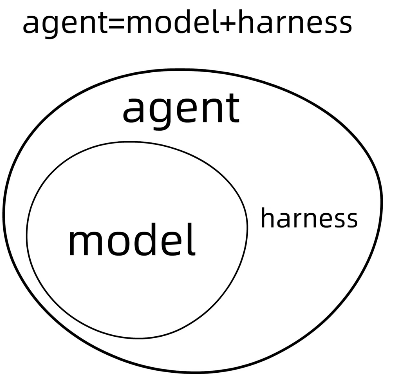

结构化来看，可以分为如下层次：

1. **上下文管理**

   - 角色和目标定义：模型要知道自己是谁、任务是什么、成功标准是什么

   - 信息选择：上下文不是越多越好

   - 结构化组织：固定规则放在哪里、当前任务放在哪里、运行状态放在哪里等

2. **工具系统**

   - 给它什么工具

   - 什么时候调用工具

   - 结果如何反馈

3. **执行编排**

   理解目标 → 判断信息 → 继续分析 → 检查输出

4. **状态与记忆**

   - 当前任务状态

   - 会话中间结果

   - 长期记忆与偏好

5. **评估与观测**

   - 输出验收

   - 环境验证

   - 自动测试
   - 指标

6. **约束与恢复**

   - 哪些能做，哪些不能做

   - 输出前怎么检查

   - 失败如何重试、回滚

需要注意的点是：写在提示词里的限制是**软约束**，由程序和运行环境拒绝的动作才是**硬约束**。即提示词只能“劝”模型别做某事，不能“保证”它做不了某事。

Claude Code 对区分指令文件与客户端强制执行的设置的说明：[官方说明](https://code.claude.com/docs/en/memory)


## 二、Harness Engineering

### Agent的运作

首先回顾，**Agent是怎么运作的**：需要撰写清楚任务需求、目前的环境、怎么工作、可调用的工具、怎样才算完成。

比方说，我现在需要让Agent去检查`parser.py`这个文件中的代码问题并修改正确。需求可以写成：修复 `parser.py` 对空输入的处理；保留既有接口；通过相关回归测试；提交前说明修改和验证证据。

那么Agent可能执行如下：

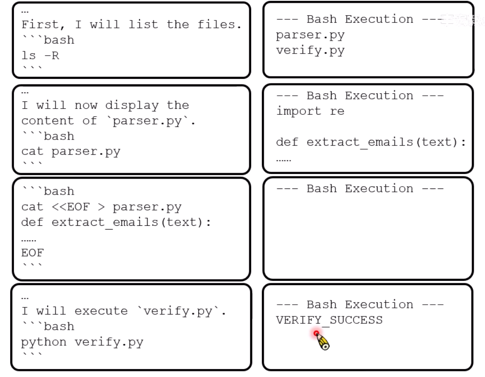


### AI Agent 的组成与强化

#### 组成

打造harness的工程即为harness engineering

将AI Agent分为两部分：**语言模型**和**harness**

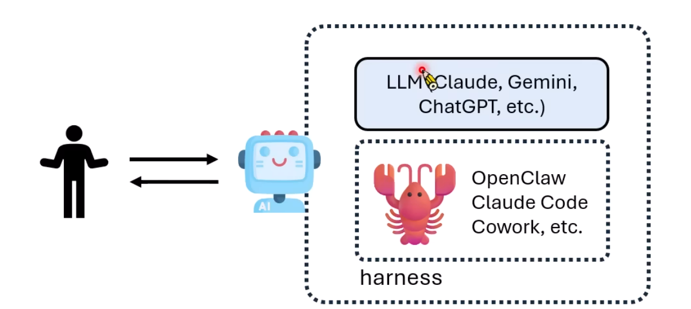


#### 强化

怎么强化AI Agent：**训练更好的模型**、**打造更好的harness**

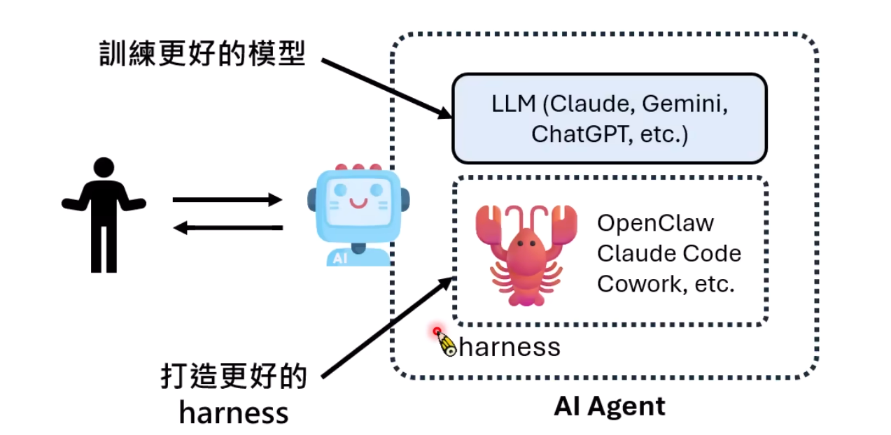

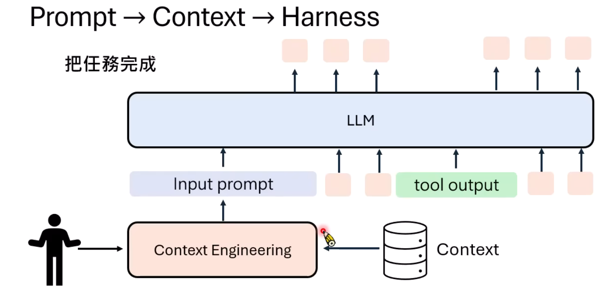


##### 1. 控制「认知框架」

###### 自然语言规则

Natural Language Harness，人类语言写的规则，大模型不一定会完全遵循。一般可以通过`AGENTS.md`、`CLAUDE.md` 等文件来规定。这类型的文档应该要像一张地图一样，告诉大模型要什么东西的话应该去哪找，而不是只把所有东西列出来。

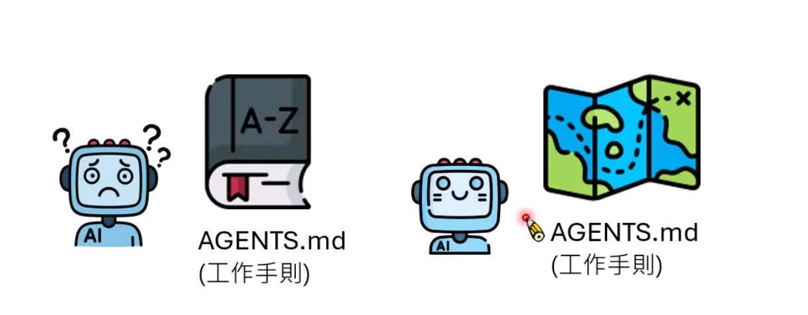

Codex和Claude Code文档：[Codex 文档](https://learn.chatgpt.com/docs/agent-configuration/agents-md)、[Claude Code 文档](https://code.claude.com/docs/en/memory)


###### 效果

https://arxiv.org/abs/2601.20404

衡量了AGENTS.md对任务完成速度的影响。

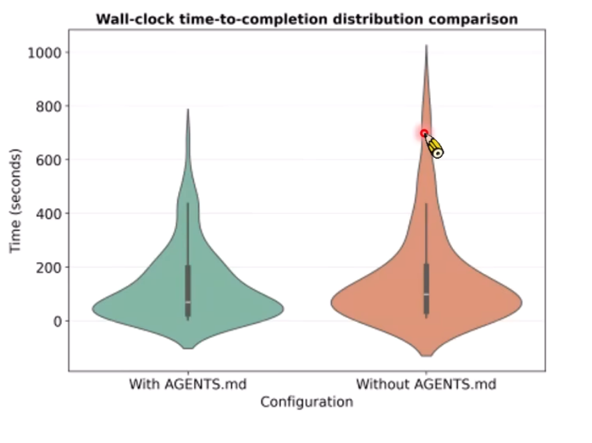

https://arxiv.org/abs/2602.11988

衡量无AGENTS.md、大模型自己写的AGENTS.md、人类写的AGENTS.md对完成任务的准确率的影响。

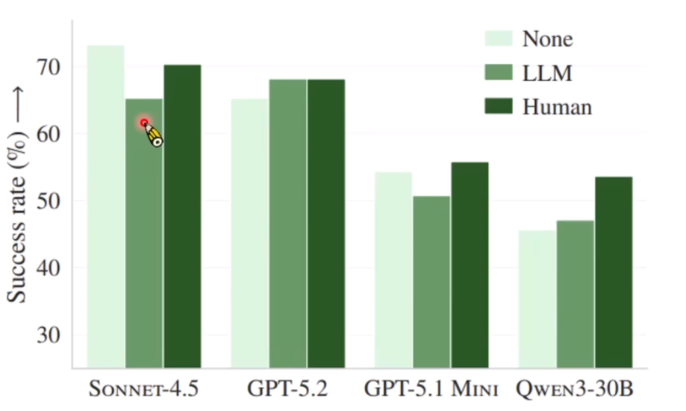


##### 2. 控制「能力边界」

###### ACI

**SWE-agent(采用并研究Agent-Computer Interface，即智能体—计算机接口这种接口设计的系统)**，是harness engineering早期雏形，为模型设计工具界面。

这篇论文研究了一些工具对Agent任务完成的影响，发现比较适合人类的工具不一定适合模型，例如：

**1.搜寻**

- 如果没有搜寻的工具，用Linux原生工具（如ls），效率低；
- 如果有搜寻工具，例如搜索引擎，一次看到多少笔资料；
- 带有摘要的搜寻工具，搜寻的时候可以看到摘要。（win）

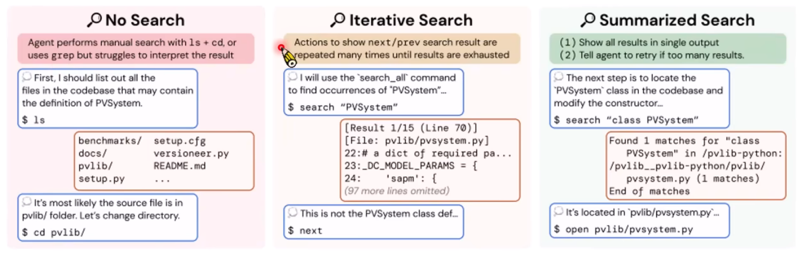

**2.编辑**

- 如果没有编辑的工具，用Linux原生工具；
- 有编辑工具，修改第几行到第几行；
- edit+Linting，修改完之后会检查语法有没有错误，有错就继续改。（win）

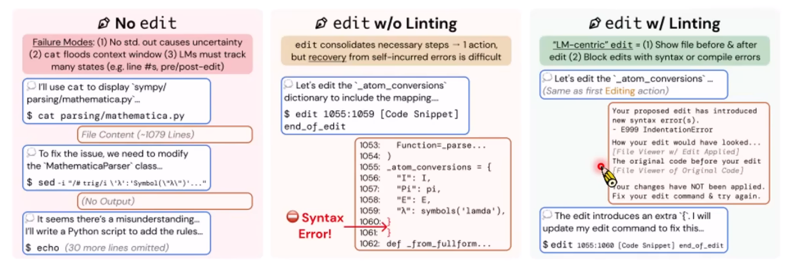


###### CLI

模型更喜欢通过CLI（Command Line Interface，命令行界面）进行交互，这是因为 CLI 的输入和输出主要都是文本，格式相对明确，也很容易放进模型的上下文中。Agent可以直接执行命令，并通过终端输出判断下一步如何进行。

除此之外，Agent 的工具调用通常也会采用 JSON 等结构化格式，例如：

```json
{
  "tool": "read_file",
  "path": "src/parser.py"
}
```

相比自然语言，结构化输入能够明确告诉系统“调用哪个工具、传入哪些参数”，也更方便程序解析和检查。


##### 3. 用「标准工作流程」来控制行为

###### 标准工作流程

不完全是让generator完成工作之后再让evaluator来评价，而是让generator和evaluator开始工作之前，generator生成一个提案，让evaluator来初步评价，evaluator接受之后，generator才开始工作，确保审查标准一致。（但未必是最好的工作流程）

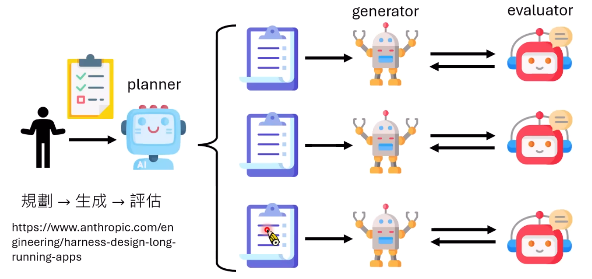


###### Ralph Loop

是 Geoffrey Huntley 提出的一类持续执行方法，让语言模型不断地做下去，有错再改。过程中不断得到反馈，调整输出。

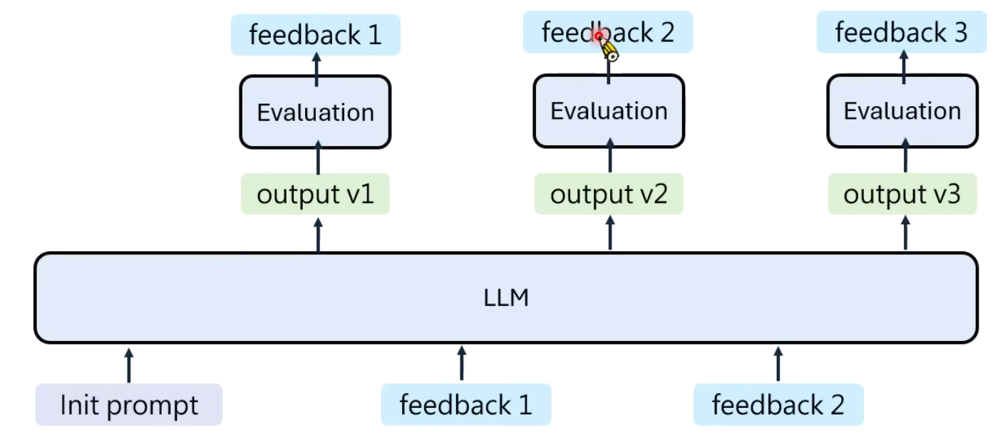

但是这样容易达到context window的上限，所以有时候采用另一个常用方法：

产生一个输出，一次feedback之后，把输出和feedback做摘要，只把摘要传递给下一轮，而不是把全部内容丢给下一轮。

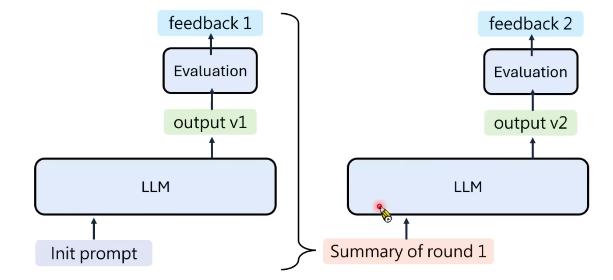


不同的模型可能适合不同的harness。

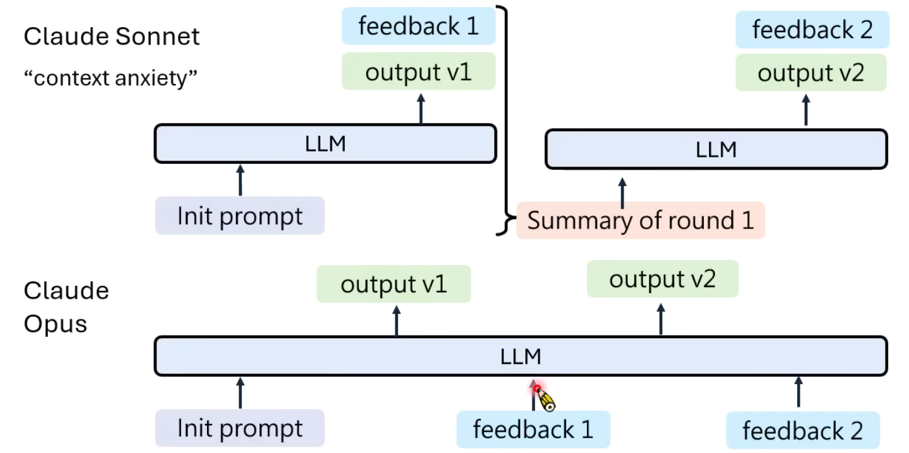


### 过度责备 AI Agent 可能有害

#### Activation steering

一种干预内部激活的研究方法。模型有一个代表情绪的向量，会随着阅读的内容而改变。

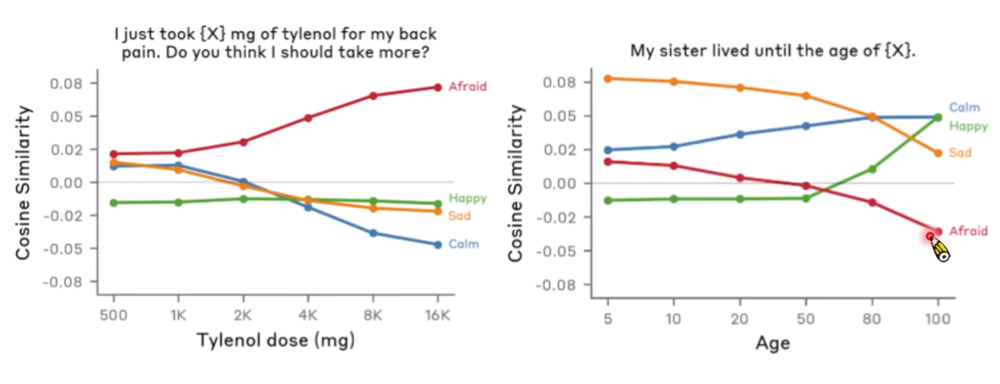

在模型解决问题的过程中，刻意加上不同情绪的向量，观察模型的行为。


#### 过度责备语言模型可能的后果

语言模型本质上是在做文字接龙，过度责备有可能导致模型真的按照责备内容做事。

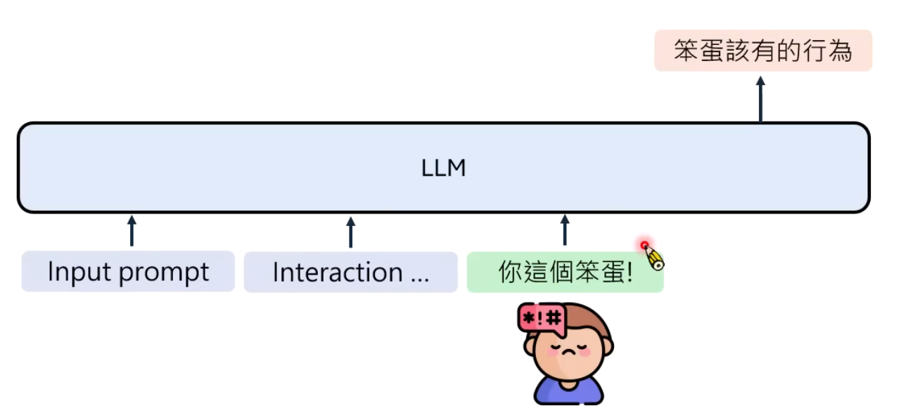


## 三、Life-long AI Agent

### 1. Claude Managed Agents Dreams

（Claude Code推出）

AI Agent在睡眠状态会整理自己的记忆，结合已有记忆与历史会话，整理重复、过时和矛盾内容。


### 2. Feedback

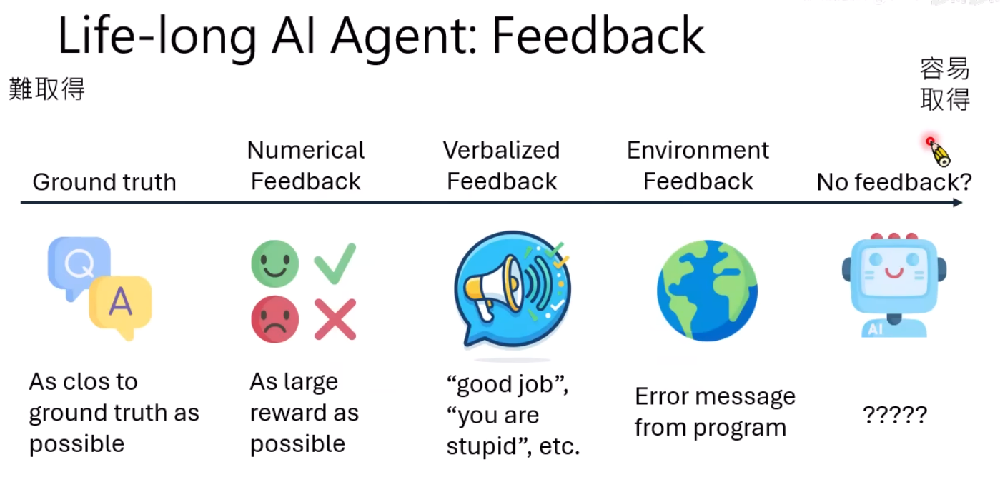

**外界反馈**：人类说明、数值评分、标准答案或环境反馈。

**自我强化**：通过skill的方式让agent学习，做出一个成功的结果后，让agent把成功的经验写成skill


#### 如何从verbalized feedback中学习

https://arxiv.org/pdf/2603.12273

在已知用户后续反馈的条件下，把feedback放在前面（“后见之明”），通过自蒸馏训练更新原策略，观察输出的变化，判断是否有feedback的指示。属于参数学习。


## 四、DeepSeek Harness

一个开源的 AI Agent 运行框架，给开发者使用的基础设施。需要安装Node.js。两种使用方法：直接使用或者下载源码之后魔改。

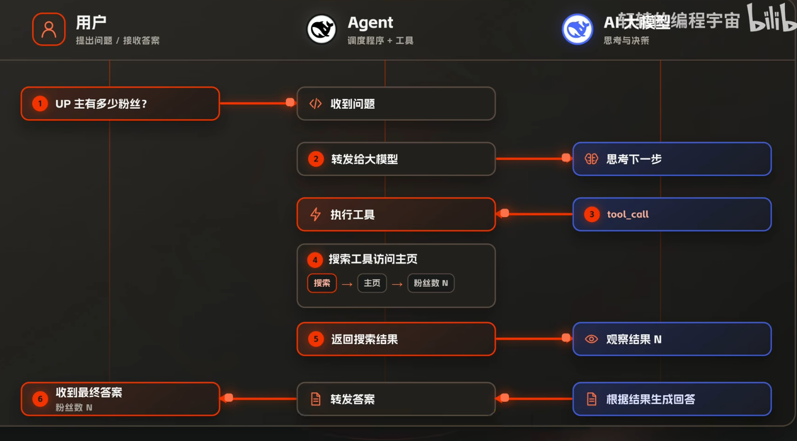


### 四种预设工作模式

DeepSeek Harness 提供四种工作模式：

- **标准模式（默认）**：完整配置，让AI在一大堆工具里面自由组合来完成任务。
- **PTC模式**：拥有标准模式的能力，但调用方式变了。模型写一段脚本程序，把中间的工具串起来调用，可以有效使得调用模型次数变少，节省token，适合高自动化任务。但是如果AI编写脚本程序失败等原因，也有可能适得其反。
- **极简模式**：系统提示词很短，仅保留了bash和str_replace_editor工具，适合用来做模型测试，观测模型在最少干预下如何解决问题。
- **创造模式**：可以查看harness目前有哪些插件，把不同插件组合起来，让agent自己组装新的agent。可以让harness创造一个新的工作模式，下次就可以直接调用这个模式完成该类任务。

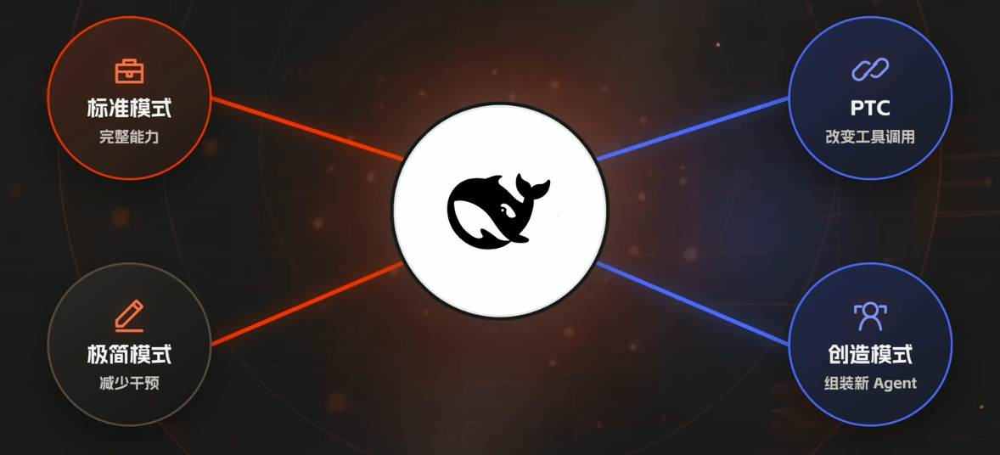


### Cordis

一个独立开源的 TypeScript 插件框架，**一切皆插件**。

DeepSeek Harness 基于 Cordis来设计架构，发扬了这种插件化设计思想，不只是各种工具，模型适配器、文件系统、Agent Loop、UI等等，都可以是插件。


## 五、问题

### 1. context anxiety 上下文焦虑

**问题**：模型知道自己的上下文窗口快满了，于是着急收尾，导致细节、重点丢失。

**常用做法**：把历史上下文压缩

**Anthropic的激进解法**：context reset，把工作交接给一个新agent（干净上下文），有点类似于内存泄漏了就重启进程。


### 2. 自评失真

**问题**：模型自己给自己打分，往往会偏乐观。尤其是设计、体验、产品完整度这类没有标准答案的问题，偏差更加明显。

**改进方法**：将生产和验收分开，分为三个角色来解决：

- Planner：负责想：应该怎么做？怎么才算完成？
- Generator：负责做：按照计划生成代码 / 文档等。
- Evaluator：负责验证：结果是否满足之前规定的完成条件？


### 3. 按需发现与渐进式披露

**问题**：把所有规范、架构等都塞进AGENTS.md，导致上下文窗口塞的太满，agent还没工作或者工作刚开始就阅读太多无用信息。

**改进方法**：将AGENTS.md变成一个目录页，只保留核心索引，详细的文档存在子文档里。


### 4. 长任务中断

**问题**：进程中断后，系统不知道哪些步骤已完成。盲目重试可能导致重复写文件或者触发外部动作，造成无意义的token浪费。

**改进方法**：保存检查点、任务状态和工具执行结果。采用**LangGraph** 的持久化机制。对有副作用的操作使用唯一操作标识和去重记录，执行前后核对目标状态等。


### 5. Harness-of-Harness 与跨多轮改进

[*Harness-of-Harness*](https://arxiv.org/abs/2609.01481v1)在现有harness之上组织规划、实现和测试循环，可以让系统持续改进交付物，而不是只检查模型是否结束。

例如，让 Agent 开发一个待办应用：

**第一轮**：实现新增待办。测试发现刷新后数据丢失。

**第二轮**：修复保存问题，并增加完成状态。测试发现已完成事项无法恢复。

**第三轮**：修复状态切换，再检查既有功能有没有被破坏。

...


## 参考来源

[最近爆火的 Harness Engineering 到底是啥？一期讲透！_哔哩哔哩_bilibili](https://www.bilibili.com/video/BV1Zk9FBwELs/?spm_id_from=333.337.search-card.all.click&vd_source=176322b30ea11023c056ae3647a5f8c0)

[（B站首推）2026李宏毅智能体【Harness Engineering】系列课程全集，公认体验感最好的入门课程！--人工智能/大模型/Agent/LLM_哔哩哔哩_bilibili](https://www.bilibili.com/video/BV1uQdhB5EbU/?spm_id_from=333.337.search-card.all.click&vd_source=176322b30ea11023c056ae3647a5f8c0)

[DeepSeek Harness到底是什么？一个动画彻底搞懂！_哔哩哔哩_bilibili](https://www.bilibili.com/video/BV1ACbi6DEvC/?spm_id_from=333.337.search-card.all.click&vd_source=176322b30ea11023c056ae3647a5f8c0)
