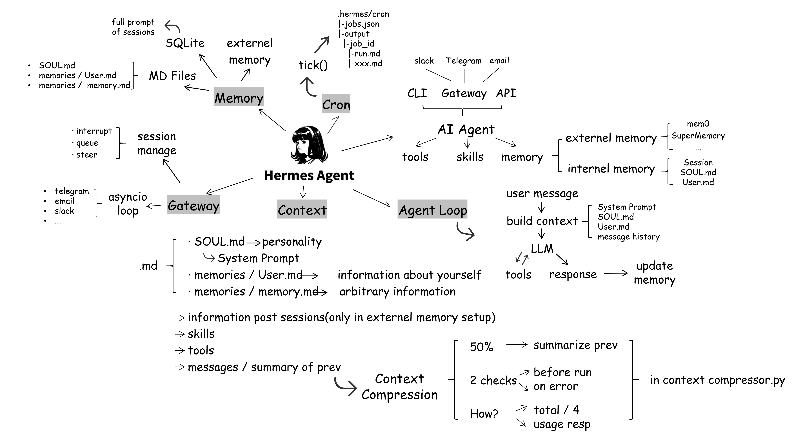
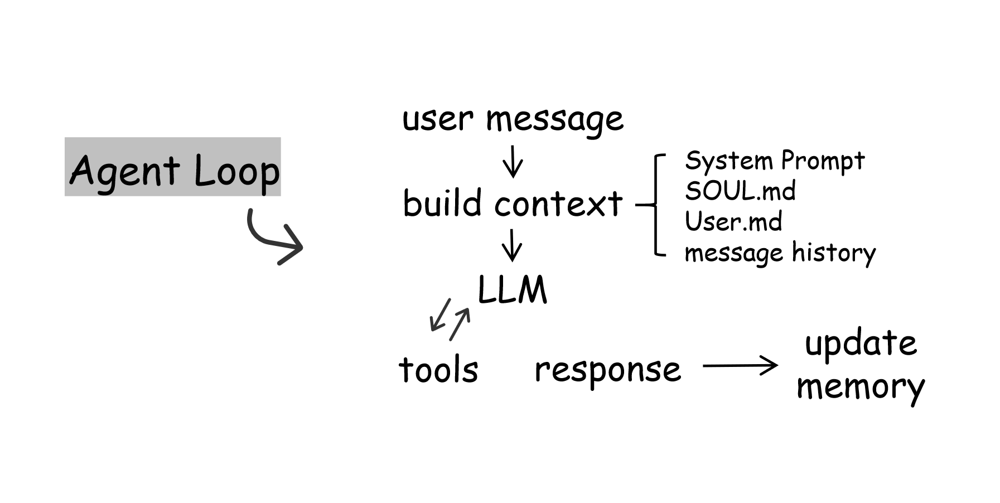
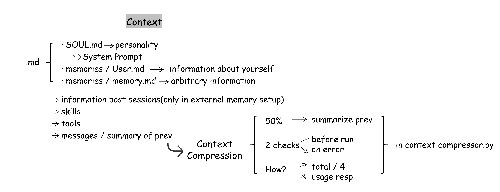
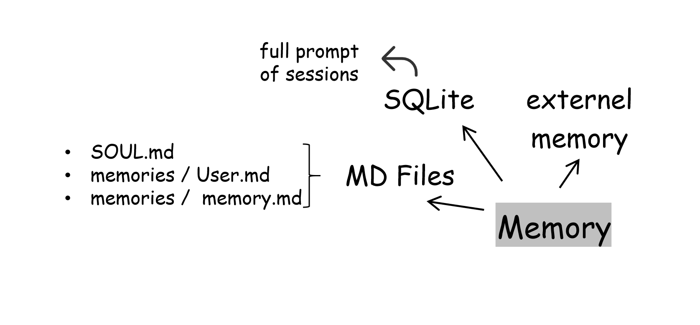
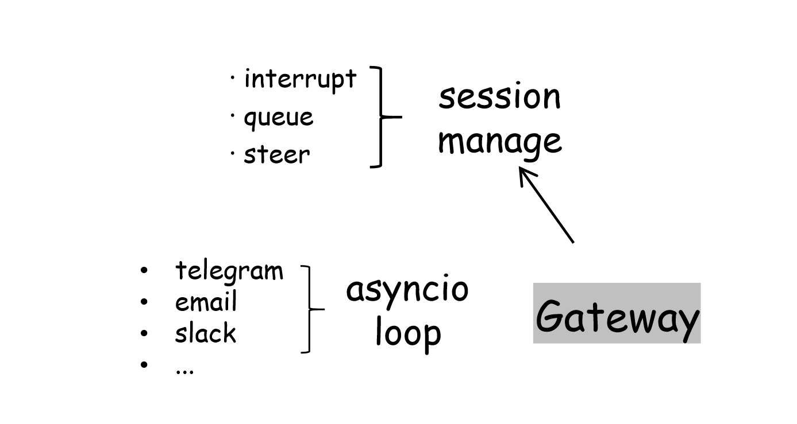
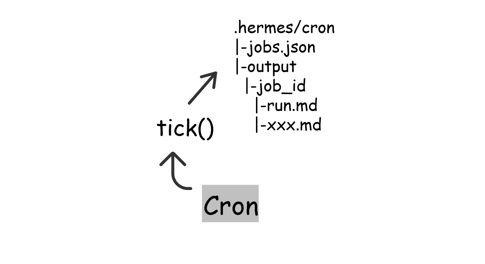

## 一、整体架构



Hermes 的核心是**智能体循环（Agent Loop）**。

用户通过命令行（CLI）、网关（Gateway）或 API 与智能体交互，智能体结合上下文调用语言模型，并使用工具、技能和记忆完成任务。

**主要组成部分**如下：

- **Agent Loop（智能体循环）**：接收消息、调用模型、执行工具，并生成最终回复
- **Context（上下文）**：提供系统提示词、用户信息、消息历史和工具结果
- **Tools（工具）**：提供可供智能体调用的具体能力，费用取决于所使用的服务和订阅
- **Skills（技能）**：提供完成特定任务的方法或流程
- **Gateway（网关）**：连接不同消息平台，并协调消息与会话
- **Memory（记忆）**：保存用户信息、事实和历史对话
- **Cron（定时任务）**：按设定时间自动触发任务


## 二、Agent Loop



用户每次发送消息时，都会触发一次处理流程：

```text
用户消息
   ↓
构建上下文
（系统提示词、SOUL.md、USER.md、消息历史等）
   ↓
调用语言模型（LLM）
   ↓
是否需要调用工具？
   ├─ 是 → 执行工具 → 将结果加入上下文 → 再次调用模型
   └─ 否 → 生成最终回复
                ↓
             保存会话及已产生的记忆变更
```

如果模型需要使用工具，就会在“模型调用—工具执行”之间继续循环，直到能够给出最终回复。记忆机制用于在交互中积累信息。


## 三、Context



### 1. 上下文的组成

上下文包含 Markdown 配置文件中的信息、消息历史和工具结果：

- `SOUL.md`：定义对话的机器人的人格、语气、交流方式等个性化设定
- `USER.md`：保存用户信息、偏好和用户画像，智能体通过 memory 工具将需要长期保留的用户信息写入这里
- `MEMORY.md`：保存精选的重要事实、环境信息和经验，不限于用户个人信息
- Message History：提供当前对话的前后文
- 过去对话的信息：可以通过内置 session_search 检索本地历史会话，无需开启外部记忆服务

`SOUL.md` 替换系统提示词中的默认身份文本；无法加载有效内容时，会回退到内置身份文本。

### 2. 上下文压缩

当对话接近设定的上下文阈值时，系统会将较早的消息整理为摘要，供后续对话使用。

上下文压缩的检查时机包括：

1. **调用模型之前**：根据已有消息估算上下文长度。
2. **工具执行后等执行节点**：检查上下文压力。

用量判断方式：

- 优先使用模型返回的 token 用量，并估算之后追加的消息；缺少实际用量时采用粗略估算。
- 调用后，利用模型返回的用量信息（usage）更新用量记录。

Agent 内置压缩的默认阈值为上下文窗口的 50%，可以自行修改；网关另有 85% 阈值的会话保护机制。


## 四、Memory



Hermes 的记忆可以分为 **Markdown 文件**、**本地 SQLite 数据库**和**外部记忆服务**三类。


### 1. Markdown 文件

- **`SOUL.md`**：保存智能体的人格与交流方式设定，属于人格配置。
- **`USER.md`**：保存用户信息与偏好，形成可由用户修改的用户画像。原笔记提到，聊天中告知智能体的个人信息可以被写入记忆。
- **`MEMORY.md`**：保存精选的重要事实或其他值得保留的信息，不限于用户个人信息。两个持久记忆文件位于 `~/.hermes/memories/`，在会话开始时以快照形式加载。


### 2. 本地数据库

完整对话记录保存在本地 SQLite 数据库中，消息历史通过会话 ID 获取，用于构建上下文。


### 3. 外部记忆服务

外部服务用于保存、提取或检索长期信息，包括 mem0、Honcho 和 SuperMemory等不同提供商。


外部记忆插件可在模型调用前检索信息、每轮结束后预取或同步对话，以及在会话结束或压缩前提取信息，具体行为取决于提供商与配置。

用户可以直接描述需要检索的信息，无需固定分成两条消息发送。


## 五、Gateway



### 1. 网关的作用

网关是消息平台与智能体之间的连接层，可以理解为接待消息并协调处理的前台管家。用户可以通过不同消息平台与智能体对话，每个第三方平台需要独立配置接入参数，一个网关进程可以连接多个平台。

网关**主要负责**：

- 接收平台消息，并交给对应的智能体处理。
- 协调消息、会话和回复的传递。
- 配合会话历史构建上下文。

完整对话历史由本地数据库保存，网关通过会话 ID 关联消息。

### 2. 运行方式

配置完成后，使用 `asyncio loop` 运行，网关持续监听或轮询消息，不同平台可能采用：

- **Webhook**：由平台主动推送消息。
- **轮询**：定期检查是否有新消息，具体间隔取决于平台实现与配置。


### 3. 智能体工作期间的新消息

当智能体仍在处理上一条消息时，会话管理机制（session manager）决定如何处理新消息：

- 中断模式（interrupt，默认）：新消息重新引导当前轮次；明确停止当前任务使用 `/stop`
- 排队模式（queue）：等待当前处理结束后再处理，需要将 busy_input_mode 配置为 queue
- 引导：向正在执行的任务补充指示，例如 `/steer`


## 六、Cron



### 1. 功能

定时任务允许用户让 Hermes 在指定时间自动执行指令。例如，每天早上 8 点执行一次邮件发送任务。


### 2. 调度与存储

cron运行的机制：

- 每分钟运行一次 `tick()`函数，检查是否有需要执行的任务并执行。
- 任务配置以 JSON 格式保存在 `jobs.json` 中。
- Cron 目录下设有 `output` 目录，按任务 ID（`job_id`）保存运行产物，每次运行的输出保存为 `{timestamp}.md`。任务配置路径为 `~/.hermes/cron/jobs.json`，输出路径为 `~/.hermes/cron/output/{job_id}/`。


### 3. 通知平台

定时任务通过 deliver 指定投递目标，可以是原聊天（origin）、本地文件（local）、平台默认频道或具体聊天。消息平台创建任务时默认 origin，CLI 创建任务时默认 local。

## 参考来源
[Hermes Architecture EXPLAINED: Memory, Context & Gateways](https://www.youtube.com/watch?v=n32qq7Kwzh0)
