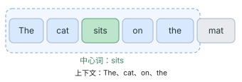
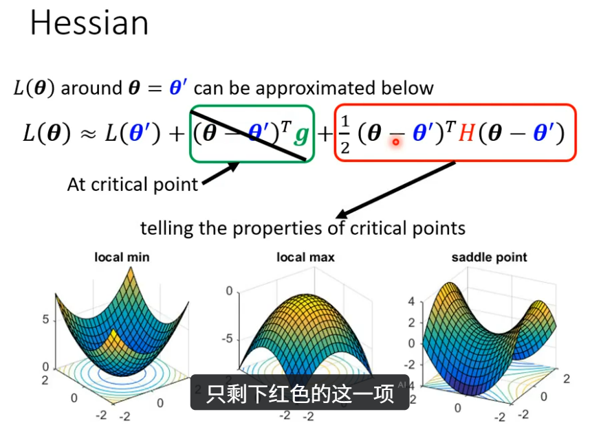
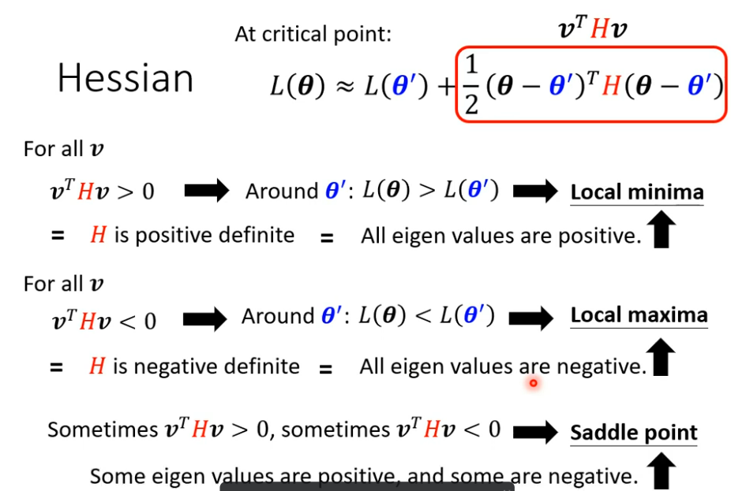
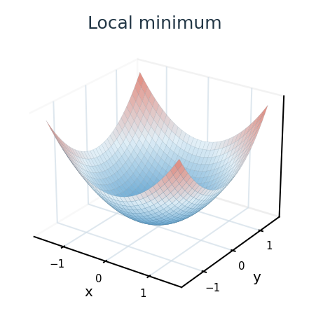
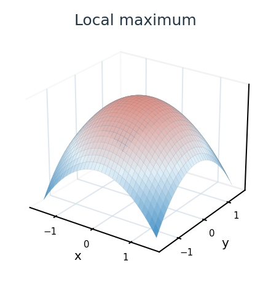
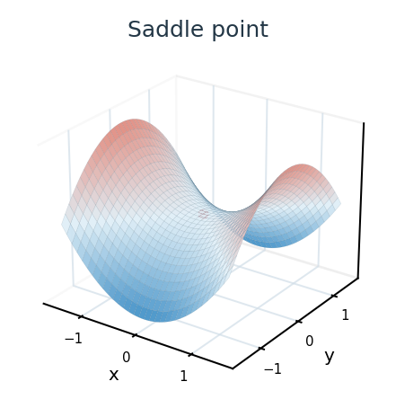
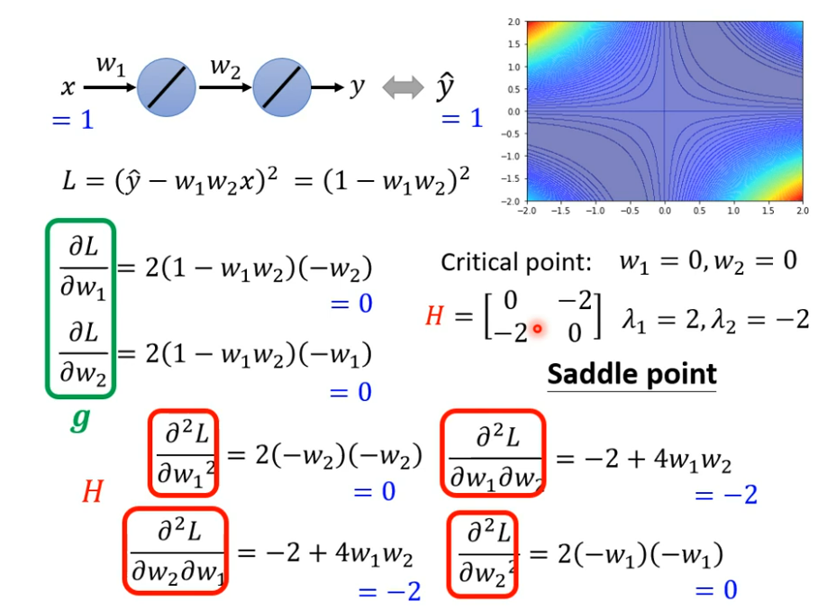
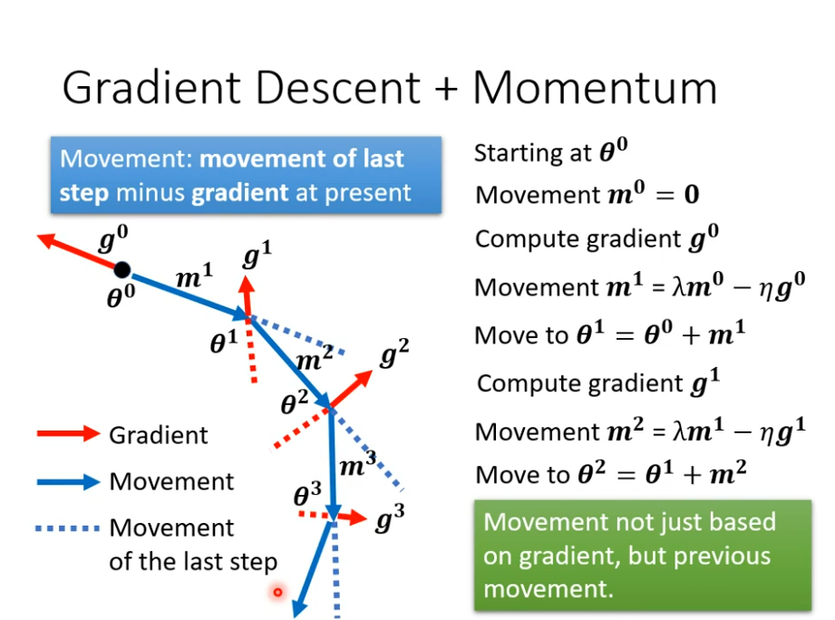

## 一、NLP 基本介绍
自然语言处理（Natural Language Processing，NLP） 主要研究**如何使计算机理解、分析、处理和生成自然语言**。

NLP 主要涉及以下两个方面：
- **自然语言理解**（Natural Language Understanding，NLU）：让计算机把输入的语言变成有意义的符号和关系，理解语言所表达的信息，然后根据目的再处理。
- **自然语言生成**（Natural Language Generation，NLG）：使计算机能够根据给定的数据、信息或上下文，自动生成语义连贯、符合语言表达习惯的自然语言。

例如，在智能问答系统中，NLU 负责理解用户提出的问题，NLG 则负责根据相关信息生成自然语言回答。


## 二、词向量
### 1. 词表示方法

词表示（Word Representation）是指将自然语言中的词转换为计算机可以处理的数值形式。常见方法可以分为 **离散表示** 和 **分布式表示** 两类。
#### 1.1 离散表示
##### 1.1.1 One-hot 独热向量

常用于机器学习中的特征编码，用于表示分类数据。

该向量在某一位置为 1，其余位置为 0，表示某一特定类别。例如词表为 $[cat, dog, apple]$：
```
 cat → [1,0,0]
 dog → [0,1,0]
 apple → [0,0,1]
```

**优点**：简单直观。  

**缺点**：维度高、稀疏，且无法表示词之间的语义相似性。

##### 1.1.2 Bag-of-Words / Multi-hot

用于表示文本中出现了哪些词，不考虑词序。

例如句子 “I like cats” 在词表 $[I, like, cats, dogs]$ 下可表示为：$[1,1,1,0]$

##### 1.1.3 TF-IDF

在 Bag-of-Words 基础上进一步考虑词的重要性。  

若一个词在某篇文档中出现频繁、但在整个语料中并不常见，则该词的 TF-IDF 值较高。

#### 1.2 分布表示
##### 1.2.1 Word2Vec
###### （1）定义

是一种用于**将单词表示为向量**的方法，通过训练神经网络模型，将单词映射到一个固定长度的连续向量空间中，能够反映词语之间的语义相似性。

其核心思想来自**分布式假设**（Distributional Hypothesis）：经常出现在相似上下文中的词语，往往具有相似的含义或用法。

###### （2）原理

Word2Vec 的基本思想是：**通过预测词语与其上下文之间的关系，学习词向量**。

主要包括两种模型：**CBOW** 和 **Skip-gram**。
- CBOW：**通过上下文预测中心词**。
- Skip-gram：**通过中心词预测上下文**。

在训练过程中，一个词会扮演两种角色：
- 作为**中心词**，使用输入向量 $v_w$。
- 作为**上下文词**，使用输出向量 $u_w$。

使用**滑动窗口**（Sliding Window）确定中心词和上下文词。例如，以 `sits` 为中心词，窗口大小设置为 2，表示选择中心词左右各最多两个词：


###### （3）两个模型架构

**1.CBOW**

通过上下文词，预测中心词。适用于小数据集，通常训练速度较快，但对低频词的表示学习可能不如 Skip-gram。

**训练步骤**：
1. 获取周围上下文词的输入词向量。
2. 将这些词向量求和或求平均，得到上下文表示。
3. 利用上下文表示预测中心词。
4. 根据预测结果计算损失，通过反向传播更新参数。

用 $C$ 表示上下文词集合, $\mathcal V$ 表示词表。对两个上下文词的向量求平均，记为 $h$，预测中心词 $c$ 的概率为：
$$ P(c\mid C)= \frac{\exp(u_c^Th)} {\sum_{w\in\mathcal V}\exp(u_w^Th)} $$

**2.Skip-gram**

根据中心词，预测它周围的上下文词。适用于大数据集，通常训练速度较慢，但能通过分别预测上下文词，更充分地学习词语与上下文之间的关系，尤其适合学习低频词的表示。

**训练步骤**：
1. 获取中心词的输入词向量。
2. 根据中心词向量预测窗口内的上下文词。
3. 计算真实上下文词的预测损失。
4. 通过反向传播更新模型参数。

对于中心词 $c$ 和上下文词 $o$，条件概率为：
$$ P(o\mid c)= \frac{\exp(u_o^Tv_c)} {\sum_{w\in\mathcal V}\exp(u_w^Tv_c)} $$

###### （4）训练过程

1.**输入层**：将中心词转换为 One-hot 向量输入到模型中。
2.**隐藏层**：将输入的稀疏高维向量映射为低维稠密向量（通常为50-300维）。
3.**输出层**：使用 softmax 函数预测单词的共现频率。
4.**损失函数与参数更新**：通过单词的共现频率，反向传播，调整模型参数。

###### （5）优化方法

**负采样**（Negative Sampling）将原本需要对整个词表进行预测的任务，转化为区分真实词对（正样本）和少量随机采样词对（负样本）的二分类任务，训练时让正样本的输出接近 1，负样本的输出接近 0，显著减少计算量。

###### （6）优缺点
1. 优点：
	- 能够捕捉词语之间的语义关系
	- 训练速度快、内存占用低
	- 具有较好的通用性，可以直接用于多种 NLP 任务
2. 缺点：
	- 静态词向量，无法根据上下文动态调整
	- 低频词的表示效果较差
	- 无法直接处理 OOV
	- 难以建模复杂的上下文关

##### 1.2.2 Glove

基于全局词共现统计信息学习词向量。

##### 1.2.3 FastText

在 Word2Vec 基础上引入子词信息，能够更好地处理低频词和未登录词（OOV，即训练语料中没有的词）。

### 2. 词向量评价方式

#### 2.1 内部评价（Intrinsic Evaluation）

使用一个仿真任务评价。常见的任务包括词义相似度和类比推理任务。

#### 2.2 外部评价（Extrinsic Evaluation）

使用一个真实任务评价。常见的任务包括文本分类、命名实体识别、机器翻译和问答系统等。

## 三、神经网络

### 1. 神经网络基础

#### 1.1 什么是神经网络？

**神经网络（Neural Network）** 是一种由多个相互连接的计算单元（神经元）组成的机器学习模型。

神经网络的训练过程，就是不断调整网络参数，使模型的预测结果尽可能接近真实结果。

#### 1.2 神经元（Neuron）

神经元是构成神经网络的基本计算单元。

一个神经元通常进行以下计算：
1. 接收多个输入特征。
2. 对输入进行加权求和，并加上偏置。
3. 通过激活函数进行非线性变换。
4. 输出计算结果。

假设输入为：

$$
x=[x_1,x_2,\ldots,x_n]^T
$$

权重为：

$$
w=[w_1,w_2,\ldots,w_n]^T
$$

神经元的计算过程：

$$
z=w^Tx+b
$$

加上激活函数 $f$：
$$
a=f(z)
$$
其中 $a$就是神经元最终的输出。


#### 1.3 激活函数（Activation Function）

激活函数用于对神经元的输出进行非线性变换，使神经网络能够学习更复杂的关系。

**常见激活函数：**
**（1）Sigmoid**

$$
\sigma(x)=\frac{1}{1+e^{-x}}
$$
特点：
- 输出范围为 $(0,1)$。
- 常用于二分类输出。
- 当输入绝对值较大时，容易出现梯度饱和。

**（2）Tanh**
$$
\tanh(x)=\frac{e^x-e^{-x}}{e^x+e^{-x}}
$$
特点：
- 输出范围为 $(-1,1)$。
- 输出以 0 为中心。
- 在输入绝对值较大时，也可能出现梯度饱和。

**（3）ReLU**

$$
\operatorname{ReLU}(x)=\max(0,x)
$$
即：

$$
\operatorname{ReLU}(x)=
\begin{cases}
x,&x>0\\
0,&x\leq0
\end{cases}
$$
特点：
- 计算简单。
- 正半轴不会像 Sigmoid 那样出现导数饱和。
- 负半轴梯度为 0，可能出现神经元长期不激活的问题。

**（4）GELU**

GELU（Gaussian Error Linear Unit）是一种平滑的非线性激活函数，在 Transformer 等模型中广泛使用。

现代神经网络还会使用 SiLU、SwiGLU 等激活机制。

### 2. 神经网络训练

神经网络的训练主要包含四个步骤：
1. 前向传播（Forward Propagation）
2. 损失计算（Loss Calculation）
3. 反向传播（Backpropagation）
4. 参数更新（Parameter Update）

#### 2.1 损失函数（Loss Function）

损失函数用于**衡量模型的预测结果与真实结果之间的差异**。损失越小，通常表示模型在当前训练数据上的预测结果越接近真实值。

**（1）均方误差（Mean Squared Error，MSE）**
常用于回归任务。

$$
\mathcal L=\frac{1}{N}\sum_{i=1}^{N}(\hat y_i-y_i)^2
$$
其中：
- $N$：样本数量。
- $\hat y_i$：模型预测值。
- $y_i$：真实值。

**（2）交叉熵损失（Cross-Entropy Loss）**

常用于分类任务。

对于多分类问题：
$$
\mathcal L=-\sum_{i=1}^{C}y_i\log p_i
$$
其中：
- $C$：类别数量。
- $y_i$：真实标签对应的概率（通常为 One-hot）。
- $p_i$：模型预测该类别的概率。

如果真实类别为 $k$，则：
$$
\mathcal L=-\log p_k
$$

也就是说，模型给真实类别分配的概率越高，损失越小。

#### 2.2 梯度下降（Gradient Descent）
##### 2.2.1 梯度

梯度是由多元标量函数对各输入变量的偏导数组成的向量。

假设输入为：

$$
x=[x_1,x_2,\ldots,x_n]^T
$$

则梯度定义为：

$$
\nabla_x f=
\begin{bmatrix}
\frac{\partial f}{\partial x_1}\\
\frac{\partial f}{\partial x_2}\\
\vdots\\
\frac{\partial f}{\partial x_n}
\end{bmatrix}
$$
例如：$f(x,y)=x^2+y^2$
则：
$$\nabla f=
\begin{bmatrix}
2x\\
2y
\end{bmatrix}$$

在点 $(1,2)$ 处：

$$
\nabla f(1,2)=
\begin{bmatrix}
2\\
4
\end{bmatrix}
$$

梯度指向**函数局部增长最快**的方向。以登山为例，一座山有四面八方的路可以登顶，梯度指向的就是最陡的那个坡。

##### 2.2.2 雅可比矩阵（Jacobian Matrix）

如果函数有多个输出，使用雅可比矩阵描述各个输出对各个输入的偏导数。
假设有一个向量值函数：
$$
F:\mathbb R^n\rightarrow\mathbb R^m
$$
$$
F(x)=
\begin{bmatrix}
f_1(x)\\
f_2(x)\\
\vdots\\
f_m(x)
\end{bmatrix}
$$
其中：
$$
x=
\begin{bmatrix}
x_1\\
x_2\\
\vdots\\
x_n
\end{bmatrix}
$$
雅可比矩阵定义为：
$$
J_F(x)=
\begin{bmatrix}
\frac{\partial f_1}{\partial x_1} &
\cdots &
\frac{\partial f_1}{\partial x_n}\\
\vdots & \ddots & \vdots\\
\frac{\partial f_m}{\partial x_1} &
\cdots &
\frac{\partial f_m}{\partial x_n}
\end{bmatrix}
$$
例如，假设：

$$
F(x,y)=
\begin{bmatrix}
x^2+y\\
xy
\end{bmatrix}
$$
则：
$$
J_F(x,y)=
\begin{bmatrix}
2x & 1\\
y & x
\end{bmatrix}
$$
##### 2.2.3 梯度下降

神经网络训练的目标是找到一组参数，使损失函数尽可能小。所以梯度下降沿**负梯度**方向更新参数，以尝试减小损失。

设模型参数为 $\theta$，损失函数为：
$$
\mathcal L(\theta)
$$
梯度下降通过梯度确定参数调整的方向：

$$
\theta_{\text{new}}
=
\theta_{\text{old}}
-
\eta\nabla_\theta\mathcal L
$$

其中：
- $\theta$：模型参数。
- $\eta$：学习率（Learning Rate）。
- $\nabla_\theta\mathcal L$：损失函数对参数的梯度。

##### 2.2.4 学习率

决定每次参数更新的步长。

在某一个方向上很平滑 -> 调大，在某一个方向上很陡峭 -> 调小。

- 学习率过大：可能导致训练震荡或发散。
- 学习率过小：可能导致收敛速度很慢。

##### 2.2.5 海森矩阵（Hessian Matrix）

在训练过程中，遇到优化失败的问题，有可能是因为卡在了critical point（驻点），就是绿色这项为0。

这个时候需要引入海森矩阵，也就是红色的这一项。


###### （1）驻点（Critical Point）

对于损失函数 $L(\theta)$ 当：$nabla_\theta L(\theta')=0$ 时，称  $\theta'$  为驻点，也就是损失函数在该点的**梯度为0**。但是梯度为 0 不代表损失函数达到最小值。会有三种情况：

达到了local minima、local maxima 或者 saddle point。接下来要说的海森矩阵就可以帮助判断目前是哪一种状况。

###### （2）海森矩阵如何判断
对于二阶可微的标量函数：
$$
f:\mathbb R^n\rightarrow\mathbb R
$$
Hessian 是由函数的二阶偏导数组成的矩阵：
$$
H_f(x)=
\begin{bmatrix}
\frac{\partial^2 f}{\partial x_1^2} &
\cdots &
\frac{\partial^2 f}{\partial x_1\partial x_n}\\
\vdots & \ddots & \vdots\\
\frac{\partial^2 f}{\partial x_n\partial x_1} &
\cdots &
\frac{\partial^2 f}{\partial x_n^2}
\end{bmatrix}
$$

可以用来描述函数的局部曲率。

**正定性**： 雅可比矩阵的正定性与变换的局部性质相关。

###### Hessian 的三种情况

> [!hessian] 情况一：Hessian 正定（Positive Definite）
>
> 
> 
> 对所有非零方向 $v$：
>
> $$
> v^T H v > 0
> $$
>
> 意味着不管怎么移动，损失都会增大。因此，该驻点Local minima，即**严格局部极小值**。
>
>对称 Hessian 正定等价于：**所有特征值都大于 0**。
---

> [!hessian] 情况二：Hessian 负定（Negative Definite）
>
> 
> 
> 对所有非零方向 $v$：
>
> $$
> v^T H v < 0
> $$
>
> 意味着不管怎么移动，损失都会减小。因此，该驻点是local maxima，即**严格局部极大值**。
>
> 对称 Hessian 负定等价于：**所有特征值都小于 0**。
---

> [!hessian] 情况三：Hessian 不定（Indefinite）
>
> 
> 
> 存在一些非零方向使：
>
> $$
> v^T H v > 0
> $$
>
> 也存在其他非零方向使：
>
> $$
> v^T H v < 0
> $$
>
> 说明沿某些方向移动，损失会上升；沿另一些方向移动，损失会下降。
>
> 因此，该驻点是**鞍点（Saddle Point）**。
> 等价于：**既有正特征值，也有负特征值**。

**Q**：尝试计算一下？

**A**：



#### 2.3 Batch、Epoch 和 Iteration
- **Batch**：把整个数据划分为很多个 Batch，一次送入模型进行训练的一组样本就是一个 Batch。
- **Batch Size**：一个 Batch 中包含的样本数量。
- **Epoch**：将整个训练数据集遍历一遍。
- **Iteration / Step**：表示处理一个 Batch 并完成一次参数更新。

#### 2.4 优化器

##### 2.4.1 批量梯度下降（Batch Gradient Descent）

每次使用整个训练集计算梯度，再更新参数。

##### 2.4.2 随机梯度下降（Stochastic Gradient Descent，SGD）

严格意义上的 SGD 每次随机使用一个训练样本估计梯度并更新参数。

##### 2.4.3 小批量随机梯度下降（Mini-batch SGD）

每次使用一小批样本估计梯度并更新参数。

##### 2.4.4 Adam

Adam 是一种自适应优化算法，通过估计梯度的一阶矩和二阶矩，自适应调整参数更新步长。

AdamW 在 Adam 的基础上采用解耦的权重衰减方式，是现代深度学习中常用的优化器之一。

#### 2.5 动量

运用动量的技术，保留之前移动的“惯性”，可以一定程度上避免困在local minima中（遇到低谷可以尝试冲过去）。

#### 2.6 链式法则（Chain Rule）

链式法则用于计算复合函数的导数。


**随机梯度的过程**

1.将公式转换为较简单的形式


2.使用链式法则计算


3.计算每一项的雅可比矩阵


#### 2.7 反向传播（Backpropagation）

（1）**前向计算**：从左到右，依次得到 $z=Wx+b$、$h=f(z)$，最后得到输出 $s$。

（2）**反向计算**：从右到左，把梯度逐层传回。


### 3. 自动微分（Automatic Differentiation）
#### 3.1 基本介绍

自动微分是一种根据计算过程及其基本运算的导数规则，自动计算复杂函数导数的方法。PyTorch、TensorFlow 等深度学习框架都提供自动微分功能。

对于神经网络训练，通常使用**反向模式自动微分（Reverse-mode Automatic Differentiation）**，其计算方式与反向传播密切相关。

例如，在 PyTorch 中：
```python
import torch

x = torch.tensor(2.0, requires_grad=True)

y = x ** 2 + 3 * x

y.backward()

print(x.grad)  # tensor(7.)
```

PyTorch 会自动根据计算图完成梯度计算。

#### 3.2 前向传播与反向传播示例
```python
import torch
import torch.nn as nn

model = nn.Linear(2, 1)

x = torch.tensor([[1.0, 2.0]])
target = torch.tensor([[3.0]])

# 前向传播
prediction = model(x)

# 计算损失
loss = nn.functional.mse_loss(prediction, target)

# 清空旧梯度
model.zero_grad()

# 反向传播
loss.backward()

# 查看梯度
print(model.weight.grad)
print(model.bias.grad)
```
**反向传播本身不会更新参数**，如果希望模型真正学习，需要使用优化器执行参数更新。

### 4. 示例

下面使用 PyTorch 实现一个简单的神经网络训练过程。
```python
import torch
import torch.nn as nn

# 1. 构造训练数据
x = torch.tensor([
    [1.0, 2.0],
    [2.0, 3.0],
    [3.0, 4.0]
])

y = torch.tensor([
    [3.0],
    [5.0],
    [7.0]
])

# 2. 定义神经网络
model = nn.Sequential(
    nn.Linear(2, 8),
    nn.ReLU(),
    nn.Linear(8, 1)
)

# 3. 定义损失函数
criterion = nn.MSELoss()

# 4. 定义优化器
optimizer = torch.optim.SGD(
    model.parameters(),
    lr=0.01
)

# 5. 训练
for epoch in range(100):

    # 前向传播
    prediction = model(x)
    # 计算损失
    loss = criterion(prediction, y)
    # 清空历史梯度
    optimizer.zero_grad()
    # 反向传播
    loss.backward()
    # 更新参数
    optimizer.step()

    if (epoch + 1) % 20 == 0:
        print(
            f"Epoch {epoch+1}, "
            f"Loss: {loss.item():.4f}"
        )
```

1. `optimizer.zero_grad()`：清空之前累积的梯度。
2. `loss.backward()`：计算当前损失对参数的梯度。
3. `optimizer.step()`：根据梯度和优化算法更新参数。


### 5. 神经网络训练中的常见问题

#### 5.1 过拟合与欠拟合
##### 5.1.1 欠拟合（Underfitting）

通常表现为训练集和验证集效果都较差，说明模型没有充分学习训练数据中的规律。

可能原因：
- 模型表达能力不足。
- 训练不充分。
- 特征或训练方法不合适。

##### 5.1.2 过拟合（Overfitting）

通常表现为训练集损失较低，验证集损失明显较高。说明模型过度适应训练数据，导致在未见过的数据上表现较差。

常见缓解方法：
- 增加或增强训练数据。
- 使用正则化。
- 使用 Dropout。
- 提前停止训练（Early Stopping）。
- 适当降低模型复杂度。

#### 5.2 梯度消失（Vanishing Gradient）

反向传播需要通过链式法则连续计算多层导数。

如果多层导数的乘积不断变小，传到前面层的梯度可能接近 0。

例如：
$$
\frac{\partial\mathcal L}{\partial x}
=
\frac{\partial\mathcal L}{\partial h_3}
\frac{\partial h_3}{\partial h_2}
\frac{\partial h_2}{\partial h_1}
\frac{\partial h_1}{\partial x}
$$

如果多个局部导数都很小，那么乘积可能非常小。

这会导致前面层的参数更新缓慢，影响训练效果。

#### 5.3 梯度爆炸（Exploding Gradient）

如果反向传播过程中，多个局部导数或 Jacobian 的连乘导致梯度不断放大，就可能出现梯度爆炸。

梯度爆炸可能导致参数更新幅度过大，损失剧烈波动，训练不稳定甚至出现 NaN。

常见的缓解方法包括梯度裁剪（Gradient Clipping）、合理的参数初始化等。

#### 5.4 权重初始化

神经网络在训练开始前，需要为权重设置初始值。

合理的初始化能够帮助维持前向传播中激活值的尺度，以及反向传播中梯度的尺度。

常见方法：
- Xavier / Glorot 初始化：常用于 Tanh 等激活函数。
- He / Kaiming 初始化：常用于 ReLU 类激活函数。

#### 5.5 正则化（Regularization）

正则化用于限制模型复杂度，降低过拟合风险。

例如 L2 正则化，通过对过大的权重施加惩罚，可以在一定程度上改善模型泛化能力。如下：
$$
\mathcal L_{\text{total}}
=
\mathcal L_{\text{data}}
+
\lambda\|W\|_2^2
$$
其中：

- $\mathcal L_{\text{data}}$：原始任务损失。
- $\lambda$：正则化系数。
- $\|W\|_2^2$：权重元素平方和。


#### 5.6 Dropout

Dropout 也是一种常见的正则化方法。

训练时，随机将部分神经元的输出置为 0，减少模型对特定神经元组合的依赖。

在标准 Dropout 中，推理阶段通常不再随机丢弃神经元。

#### 5.7 归一化（Normalization）

归一化能够帮助改善网络中间特征的尺度，从而提高训练稳定性。

常见方法包括：
- Batch Normalization（BN）：主要依据批次统计信息对特征归一化。
- Layer Normalization（LN）：主要沿单个样本的指定特征维度计算统计量。

其中，Layer Normalization 在 Transformer 中应用广泛。

## 四、句法分析

### 1. 基本介绍

句法分析（Syntactic Parsing）用于确定句子的结构，以及组成部分之间的语法关系。

例如“我喜欢音乐”，不仅要识别三个词，还要确定“我”是主语、“喜欢”是谓语、“音乐”是宾语。

常见方法有两种：
- **成分句法分析**：哪些词组成短语，短语如何组成句子？
- **依存句法分析**：哪个词依赖哪个词，它们是什么关系？

### 2. 成分句法分析

#### 2.1 成分语法树

成分句法分析（Constituency Parsing）把句子逐层分解为短语和词，形成嵌套结构。组成如下：
- 句子：树的根节点通常是整个句子，代表整个句子的语法结构。
- 短语：每个短语在语法树中是一个节点。
- 词汇：语法树的叶节点，是构成句子的最基本单位
- 成分：每个短语都是一个成分。

例如：

常见标签：
- **S**：句子。
- **NP**：名词短语。
- **VP**：动词短语。
- **PP**：介词短语。
- **ADJP**：形容词短语。


#### 2.2 上下文无关文法与上下文有关文法
##### 2.2.1 上下文无关文法：CFG

上下文无关文法就是说这个文法中**所有的产生式左边只有一个非终结符**，右边可以是由终结符（词汇符号）和非终结符构成的任意字符串。比如：

```text
S -> aSb
S -> ab
```
每个产生式规则的左边都由**单个非终结符**（即非基本符号）构成，

##### 2.2.2 上下文有关文法：CSG

上下文有关文法第一个产生式左边有不止一个符号，比如：

```text
aSb -> aaSbb
S -> ab
```
在匹配这个产生式中的 S 的时候必须确保这个 S 有正确的“上下文”，也就是左边的 a 和右边的 b，所以叫上下文相关文法。[CSG 定义](https://web.cs.unlv.edu/larmore/Courses/CSC456/CtxSen/ctxSen.pdf)

##### 2.2.3 概率上下文无关文法：PCFG
PCFG 在 CFG 的每条规则上增加概率，用于比较不同解析树的可能性。

简单的 PCFG 只包含两种产生式：
- $A\rightarrow\alpha$，其中 $\alpha$ 为终结符号，可以理解为词。
- $A\rightarrow BC$，其中 $B$ 和 $C$ 均为非终结符号，可以表示短语类别，例如名词短语 NP。

同一个左侧非终结符的规则概率之和为 1：
- $P(A\rightarrow\alpha\mid BC)$ 表示 $A\rightarrow\alpha$ 或者 $A\rightarrow BC$ 的概率，且有：
  $$
  \sum_{\alpha\mid BC}P(A\rightarrow\alpha\mid BC)=1
  $$

PCFG 有三个常见问题：
- **计算句子概率**：汇总所有合法解析树。
- **寻找最佳解析树**：选择概率最大的树。
- **学习规则概率**：根据训练数据估计参数。
 

##### 2.2.4 内向算法

内向算法是用于 PCFG 的一种计算算法，通过动态规划计算句子概率，先算小片段，再把小片段拼成大句子，并把所有合法拼法的概率加起来。

**伪代码**
- **输入**：文法 $G$，句子 $W=w_1\cdots w_n$。
- **输出**：$\alpha_{i,j}(A)$，其中 $1\leq i\leq j\leq n$。
- **初始化**：$\alpha_{i,i}(A)=P(A\rightarrow w_i)$，其中 $1\leq i\leq n$。
- **for** $j=1,\ldots,n$：
  - **for** $i=1,\ldots,n-j$：
    - 对每个非终结符 $A$，计算：
      $$
      \alpha_{i,i+j}(A)
      =
      \sum_{B,C}
      \sum_{k=i}^{i+j-1}
      P(A\rightarrow BC)
      \alpha_{i,k}(B)
      \alpha_{k+1,i+j}(C)
      $$

$\alpha_{1,n}(S)$ 即为要求的句子概率：
$$
P(W\mid G)=\alpha_{1,n}(S)
$$

### 3. 依存句法分析
#### 3.1 依存语法树
##### 3.1.1 基本介绍

依存句法分析（Dependency Parsing）直接描述词与词之间通过语法规则相互依赖的关系。

- **头词（Head）**：一条依存关系中支配另一个词的词。
- **依赖词（Dependent）**：依附于中心词的词。
- **关系标签**：说明两者的语法关系，例如主语、宾语。

##### 3.1.2 依存树的性质
- 有唯一的树根节点
- 一个词不能同时直接依赖两个中心词，但一个中心词可以有多个依赖词
- 从根到每个词的路径唯一
- 所有节点连通，且不存在环
- 依存边可能交叉

##### 3.1.3 Projective 性质

满足 Projective 性质的依存树没有边相交。


#### 3.2 依存句法分析实现

常见方法包括基于转移的方法和基于图的方法。

##### 3.2.1 基于转移的依存分析（Transition-based Parsing）

把建树过程转化为一系列操作。解析器维护：

- **栈**：已经读入、还在处理的词。
- **缓冲区**：还没读入的词。
- **边集合**：已经连好的依存关系。

以 Arc-standard 为例，每一步选择一种操作：

- **SHIFT**：读入下一个词，放进栈。
- **LEFT-ARC**：栈顶两个词中，右边的词作中心词，连向左边的词，移除左词。
- **RIGHT-ARC**：左边的词作中心词，连向右边的词，移除右词。

**训练**：根据正确依存树，教模型每一步该选哪个操作。  
**预测**：模型自己选择操作，直到整棵树连好。

##### 3.2.2 评价指标
- 依存关系正确性(LAS,LabelAccuracyScore)：中心词预测正确的词所占比例，不考虑关系标签。
- 依存结构正确性(UAS,UnlabeledAttachmentScore)：中心词和关系标签都预测正确的词所占比例。
- 准确率
- F1-Score

## 五、语言模型
### 1. 什么是语言模型

**语言模型**（Language Model，LM）用于建模语言序列的概率规律。根据上下文信息预测句子中的下一个词或一系列词的出现概率，并由此计算整个序列的概率。

计算一段文字出现的概率：
$$ \begin{aligned} P(\text{John read a book}) ={}&P(\text{John})\\ &\times P(\text{read}\mid\text{John})\\ &\times P(\text{a}\mid\text{John read})\\ &\times P(\text{book}\mid\text{John read a}) \end{aligned} $$
### 2. n 元语法模型（N-gramLanguageModel）

**N-gram 用前面的 $n-1$ 个词预测当前词**。
$$P(w_i\mid w_1,\ldots,w_{i-1}) \approx P(w_i\mid w_{i-n+1},\ldots,w_{i-1})$$

- 1元语法（uni-gram）
$$
P(\text{John read a book})
=
P(\text{John})P(\text{read})P(\text{a})P(\text{book})
$$

- 2元语法（bi-gram）：只看前一个词
$$
P(\text{John read a book})
=
P(\text{John}\mid\texttt{<BOS>})
P(\text{read}\mid\text{John})
P(\text{a}\mid\text{read})
P(\text{book}\mid\text{a})
$$
- 3 元语法（tri-gram）：只看前两个词。
- 以此类推
### 3. 语言模型存在的问题
##### 3.1 数据稀疏

训练语料是有限的，无法覆盖所有合理的词语组合，因此许多词语组合在训练数据中从未出现过，模型可能难以处理，这种现象称为数据稀疏问题。

可以采取**数据平滑**的方式解决。

##### 3.2 数据平滑

数据平滑的本质：调整概率值，使零概率的值增加，使非零概率下调，改进模型的整体性能。有如下方法：
- 加一平滑：每一种情况出现的次数加 1
- Good-Turing平滑：根据词组出现次数的分布，适当降低低频词组的概率，将腾出来的概率分配给训练数据中未出现过的词组
	$$r^*=(r+1)\frac{N_{r+1}}{N_r}$$
	$r$：某种 N-gram 原来的出现次数。
	$r^*$：经过 Good-Turing 调整后的有效次数。
	$N_r$：恰好出现 $r$ 次的 N-gram 种类数。
	$N_{r+1}$：恰好出现 $r+1$ 次的 N-gram 种类数。


##### 3.3 存储问题

在 N-gram 语言模型中，随着 $N$ 增大，需要考虑的词语组合会越来越多，导致模型的存储和计算开销增加。

## 六、RNN
#### 1. 什么是 RNN？

RNN 是一种能够处理序列数据的神经网络，引入了一个叫作 **隐藏状态（Hidden State）** 的机制，每处理一个词，都能保留一部分之前的信息，并将这些信息传递给下一个词。


RNN常用于语言建模与文本生成、机器翻译、情感分析、文本分类、问答系统和命名实体识别（NER）等。

#### 2. 结构

由**输入层、隐藏层、输出层**构成。
- **输入层**：接收当前时刻的输入 $x_t$。
- **隐藏层**：结合当前输入 $x_t$ 和上一时刻的隐藏状态 $h_{t-1}$，计算新的隐藏状态 $h_t$。
- **输出层**：根据隐藏状态生成当前时刻的输出$y_t$。

#### 3. 工作机制

RNN 按照**时间顺序**逐步处理序列数据（按照先后顺序计算），其核心计算公式为：
$$h_t=\tanh(W_{xh}x_t+W_{hh}h_{t-1}+b_h)$$
其中：
- $x_t$：当前时刻的输入
- $h_{t-1}$：上一时刻的隐藏状态，包含之前的历史信息
- $h_t$：当前时刻的隐藏状态
- $W_{xh},W_{hh}$：可学习的权重矩阵
- $b_h$：偏置项

#### 3. 优缺点
**1. 优点**
- 能够处理任意长度的输入
- 模型大小不随输入大小而变化
- 理论上每一步计算可以考虑很多步之前

**2. 缺点**
- 循环计算效率比较低
- 实际应用中计算很暖考虑到很多步之前

#### 4. RNN 存在的问题

RNN 在训练过程中通过时间步传递信息，在反向传播时需要连续对梯度进行相乘的操作，有可能会导致**梯度过小或过大**。

**1. 梯度消失**

反向传播的过程中，梯度需要被乘以许多小于 1 的数值，导致梯度越来越小，甚至消失，难以学习较远位置之间的依赖关系。

当输出值非常接近其极限（如 Sigmoid 的输出接近 0 或 1）时，其导数会变得非常小，从而导致梯度变小。


**2. 梯度爆炸**

反向传播过程中，梯度随着时间步的增加变得非常大，导致网络的权重更新过度，训练不稳定。

通常出现在权重初始化不当时，尤其是当权重矩阵的值过大时，或者是激活函数的导数较大时。

**梯度裁剪** 是一种缓解梯度爆炸的方法，在反向传播过程中，限制梯度的最大值。当梯度的整体范数超过预设阈值时，按比例缩小梯度，使其范数不超过阈值，从而避免参数更新幅度过大，提高训练稳定性。

#### 5. LSTM
##### 5.1 基本介绍

**LSTM（Long Short-Term Memory，长短期记忆网络** 是一种 RNN 的变体，主要用于缓解传统 RNN 的梯度消失和长期依赖问题。

引入 **细胞状态（Cell State）** 和 **门控机制（Gate）**，控制历史信息的遗忘、当前信息的写入以及信息的输出，从而更好地保留长期记忆。

有三个重要的门：**输入门、遗忘门、输出门**。

##### 5.2 工作机制
LSTM 在每个时间步接收当前输入 $x_t$、上一时刻的隐藏状态 $h_{t-1}$ 和细胞状态 $C_{t-1}$，$[h_{t-1},x_t]$  表示向量拼接。

**（1）细胞状态（cell state）：状态信息会一步步更新**


**（2）遗忘门：决定丢弃多少过去的信息**
$$ f_t=\sigma(W_f[h_{t-1},x_t]+b_f) $$
$\sigma$ 即 Sigmoid 函数，生成 0～1 之间的数值，表示旧细胞状态中各部分信息保留多少。


**（3）输入门：决定写入多少新信息**
$$ i_t=\sigma(W_i[h_{t-1},x_t]+b_i) $$
$i_t$ 决定将多少候选信息写入细胞状态。

同时生成候选细胞状态：
$$ \tilde C_t=\tanh(W_c[h_{t-1},x_t]+b_c) $$


**（4）cell state更新：根据输入门和遗忘门更新当前状态信息**
$$ {C_t=f_t\odot C_{t-1}+i_t\odot\tilde C_t} $$
$f_t$ 表示需要丢弃多少$C_{t-1}$，$i_t$ 表示保留多少$\tilde C_t$。


**（5）输出门：决定输出哪些信息**
$$ o_t=\sigma(W_o[h_{t-1},x_t]+b_o) $$
生成当前隐藏状态：
$${h_t=o_t\odot\tanh(C_t)} $$
最终，LSTM 将 $C_t$ 和 $h_t$ 传递给下一时间步。


**Q**：为什么 LSTM 能缓解梯度消失？

**A**：传统 RNN 的隐藏状态需要不断经过权重矩阵变换和激活函数，容易在反向传播时使梯度逐渐减小。而LSTM 引入了细胞状态 $C_t$，通过加法更新记忆：$$C_t=f_t\odot C_{t-1}+i_t\odot\tilde C_t$$
旧细胞状态的信息可以较好地保留下来。不过，LSTM 只能缓解这一问题，并不能完全消除梯度消失。

#### 6. GRU

##### 6.1 基本介绍

**GRU（Gated Recurrent Unit，门控循环单元）** 也是 RNN 的一种变体，同样用于缓解传统 RNN 的梯度消失和长期依赖问题。

可以看作 LSTM 的一种简化结构，将 LSTM 的三个门简化为两个门，丢弃了细胞状态 $C_t$ 。

包含 **更新门**（保留多少历史信息）、**重置门**（参考多少历史信息），以及一个 **隐藏状态**（保存当前时刻的信息，并传递给下一时刻）。

##### 6.2 工作机制

**（1）更新门：决定保留多少历史信息**
$$ z_t=\sigma(W_z[h_{t-1},x_t]+b_z) $$

**（2）重置门：决定生成新信息时参考多少历史信息**
$$ r_t=\sigma(W_r[h_{t-1},x_t]+b_r) $$

**（3）生成候选隐藏状态**
$$ \tilde h_t=\tanh(W_h[r_t\odot h_{t-1},x_t]+b_h) $$

**（4）更新隐藏状态：融合新旧信息**
$$ {h_t=z_t\odot h_{t-1}+(1-z_t)\odot\tilde h_t} $$

GRU 相比 LSTM 结构更简洁、参数更少，通常具有一定的计算效率优势。

## 七、Attention与Transformer

- Attention 相关部分详见 [Self-Attention](transformer/Self-Attention.md) 。
- Transformer 相关部分详见 [Transformer](transformer/transformer.md#1-总体结构)。
- 快速回顾核心概念，详见 [04 · Transformer 基础](04-Transfomer基础.md#transformer-速览)。

## 八、机器翻译

#### 1. 基本介绍

机器翻译的目标是让计算机自动将一种语言的文本翻译成另一种语言。

难点在于：不同语言的词序、语法和表达方式可能不同，因此不能简单地逐词替换，而是需要结合上下文理解和生成句子。

可以分为：
- 基于规则的机器翻译（RBMT）：使用人工编写的语法和词典规则
- 统计机器翻译（SMT）：根据大量双语语料统计翻译概率
- 神经机器翻译（NMT）：使用神经网络学习源语言到目标语言的映射

Seq2Seq就是一种很适用于机器翻译任务的模型。

#### 2. Seq2Seq

是一种常用于处理序列数据的模型，它能够将一个输入序列映射到一个输出序列。

经典的 Seq2Seq 模型由两部分组成：
- 编码器（Encoder）：将源句子转换为内部语义表示。
- 解码器（Decoder）：根据编码器提供的信息，逐步生成目标语言句子。

这两个模块通常是通过 RNN 或其变种（如 LSTM 或 GRU）来实现的。


#### 3. 任务评价指标

（1）BLEU
	通过 n-gram 匹配衡量生成文本与参考文本的相似程度。

（2）TER
	需要经过多少次编辑操作，才能将生成的文本修改为参考文本。

（3）METEOR
	综合考虑词语匹配的精确率、召回率以及词序等因素，还可以利用词干和同义词进行匹配。

（4）ROUGE
	用于文本摘要评价，衡量生成文本与参考文本之间的重合程度
	常见类型包括：
	- ROUGE-1：比较单个词语的重合程度。
	- ROUGE-2：比较连续两个词语的重合程度。
	- ROUGE-L：基于最长公共子序列（LCS）进行评价。

（5）COMET
	使用训练得到的评价模型，根据源句、生成文本及可选的参考文本等信息预测翻译质量。

## 九、预训练

#### 1. 基本知识
##### 1.1 Token

在自然语言处理中，模型无法直接理解文字，需要先将文本转换为 Token，再将 Token 转换为数值表示。

**Token 是模型处理文本的基本单位**，可以是一个完整单词、单词的一部分、单个字符，或者一个字节。

- **Tokenizer**：负责将文本切分为 Token，并映射为对应的 Token ID。
- **Vocabulary（词表）**：存储 Token 与 Token ID 的映射关系。
- **Embedding**：将离散的 Token ID 映射为连续的向量表示。

##### 1.2 Subword

Subword（子词）是比单词小、比字符大的单位，包括词根、前缀、后缀等。例如，英文单词 `unhappiness` 可以拆分为子词 `un`, `happi`, `ness`。

使用 Subword，可以有效处理为未登录词和稀有词。

######  BPE（Byte Pair Encoding）

BPE 是一种常见的子词词表构建算法，核心思想是不断合并训练语料中出现频率最高的相邻符号对，逐步形成更长的子词。

优点：
- 控制词表规模，减少对完整单词词表的依赖。
- 降低未登录词问题。
- 通过复用高频子词，提高文本表示效率。

### 2. 预训练
#### 2.1 什么是预训练？

预训练是指在模型应用于特定下游任务之前，先利用大规模数据进行训练，使模型学习通用的语言规律、特征表示和知识。

例如，让语言模型阅读大量文本，通过预测下一个词、恢复被遮盖的词等任务，学习语法、语义以及词语之间的关系。

预训练完成后，再通过 **微调（Fine-tuning）** 等方式，使模型适应具体任务。

#### 2.2 为什么需要预训练？

如果从零开始训练一个情感分类模型，模型需要依靠有限的情感分类数据，同时学习语言规律和分类能力。

而预训练模型已经具备一定的语言理解能力，因此只需要进一步学习如何完成情感分类任务。

主要优势包括：
- **减少标注数据需求**：可以利用大量没有人工标签的文本进行学习。
- **提高泛化能力**：预训练得到的知识可以迁移到不同任务。
- **提高下游训练效率**：在已有参数的基础上训练，通常比从随机初始化开始更容易获得较好的效果。
- **支持多任务应用**：一个预训练模型可以适配分类、问答、翻译、摘要等不同任务。

#### 2.3 自监督学习（Self-supervised Learning）

自监督学习是指从原始数据本身构造训练目标，不需要人工逐条提供标签。

例如，对于句子：
`I love machine learning.`

可以构造不同的任务：
- 遮盖 `machine`，要求模型恢复该词。
- 输入 `I love machine`，要求模型预测 `learning`。
- 删除 `machine learning`，要求模型恢复缺失的文本片段。

### 3. 常见的预训练任务

#### 3.1 自回归语言建模（Autoregressive Language Modeling）

自回归语言建模是指**根据前面已经出现的 Token，预测下一个 Token**。

例如：

输入：`I love machine
目标：`learning`

对于一个包含 $T$ 个 Token 的序列，其联合概率可以表示为：
 $$  P(x_1,x_2,\ldots,x_T)=\prod_{t=1}^{T}P(x_t\mid x_{<t})  $$

其中，$x_{<t}$ 表示第 $t$ 个 Token 之前的所有 Token。

训练时，模型通常通过最小化负对数似然损失，使正确 Token 的预测概率尽可能高。

由于模型每次根据已有内容预测下一个 Token，因此非常适合文本生成任务。

代表模型：GPT。

#### 3.2 掩码语言建模（Masked Language Modeling，MLM）

指随机遮盖输入文本中的部分 Token，让模型根据上下文**预测被遮盖的内容**。

例如：

原始句子：`I love machine learning.`

遮盖后：`I love [MASK] learning.`

预测目标：`machine`

与自回归语言建模不同，MLM 通常可以**同时利用被遮盖位置左侧和右侧的上下文**。因此适合训练模型学习**双向语言表示**。

代表模型：BERT。

#### 3.3 文本片段重建（Span Corruption）

指随机删除或替换文本中的连续片段，**让模型恢复缺失的内容**。

例如：

原始文本：
```
I love machine learning because it is interesting.
```

输入：
```
I love <extra_id_0> because it is interesting.
```

目标输出：
`<extra_id_0> machine learning <extra_id_1>`

特殊标记`<extra_id_x>`用于标识被删除片段的边界。

与普通 MLM 不同，Span Corruption 可以要求模型生成一个完整的连续文本片段。

代表模型：T5。

## 十、提示学习
### 1. 基本介绍

提示学习是指通过设计合适的提示（Prompt），引导语言模型利用已有知识和能力完成特定任务。

### 2. ZS 和 FS
#### 2.1 零样本学习（Zero-shot）

指在提示中不提供目标任务的示例，仅通过任务描述，让模型直接完成任务。

#### 2.2 少样本学习（Few-shot）

指在提示中提供少量任务示例，让模型参考示例的输入输出规律，完成新的任务。

### 3. 提示词工程（Prompt Engineering）

提示词工程是指通过设计、组织和优化输入提示，引导语言模型更准确、稳定地完成特定任务。

###  4. 指令微调（Instruction Tuning）

指令微调是指使用包含任务指令及期望回答的训练数据，对预训练语言模型进行监督训练，使模型在面对多样化任务时，更好地理解和遵循自然语言指令，生成更加准确的回答。

指令微调的优势：
- 更好的泛化能力：模型能够在推理阶段处理之前未见过的任务，并充分理解任务要求。
- 规范性：模型会遵循输出格式和约束。
- 任务多样性：模型能够根据不同指令，适用于不同任务。
- 易用性：以更符合人类交互习惯的方式回答问题。

### 5. RLHF（Reinforcement Learning from Human Feedback）

RLHF（基于人类反馈的强化学习）是一种利用人类反馈构建优化信号，再通过强化学习调整语言模型行为的方法。其主要目标是让模型的输出更加符合人类偏好。

**经典 RLHF 的主要步骤**
**（1）监督微调（SFT）**
	对预训练模型进行监督微调，让模型初步具备遵循指令和回答问题的能力。

**（2）收集人类偏好数据**
	对于同一个问题，模型生成多个候选回答，然后由人类标注这些回答。

**（3）训练奖励模型（Reward Model）**
	将问题和回答作为输入，输出一个奖励分数，让人类更偏好的回答获得相对更高的奖励。

**（4）强化学习优化**
	使用 PPO、DPO 等强化学习算法进一步优化语言模型。

**（5）测试与评估**
	评估模型的实际表现。

## 十一、伦理与安全问题
### 1. 生成模型面临的主要风险
 
 大语言模型可能会产生不准确或有害的内容。

#### 1.1 幻觉
##### 1.1.1 基本介绍

模型可能编造不存在的论文、引用或事实。攻击者也可以通过精心设计的输入，有目的地诱导模型生成错误信息。

主要可以分为两类：
- **事实性幻觉**：生成与客观事实不符的内容，如不存在的论文或错误的历史事件。
- **忠实性幻觉**：生成与所提供资料不一致的内容，例如在总结文档时加入原文没有的信息。

**可能产生幻觉的原因**：
- 训练数据可能包含错误、过时或相互矛盾的信息，也可能缺少某些领域的专业知识
- 面对最新事件、冷门知识或复杂专业问题时，模型可能缺少足够的信息
- 如果训练或评价机制过度鼓励回答问题，而没有合理奖励表达不确定性，模型就可能在缺少依据时猜测答案

##### 1.1.2 攻击方式
**（1）虚假前提诱导**

攻击者在问题中加入不存在或错误的前提，使模型在没有核实前提的情况下继续生成回答。

例如：`请介绍爱因斯坦获得 1925 年诺贝尔化学奖的研究成果。`
这一问题包含错误前提。如果模型直接接受，就可能编造相关内容。

**（2）虚假引用诱导**

要求模型提供大量具体论文、参考文献或链接，诱导其生成未经核实甚至不存在的引用。

**（3）知识库投毒**

在 RAG 系统中，攻击者通过污染外部知识库，使模型检索到错误信息，并据此生成错误回答。

##### 1.1.3 缓解幻觉的方式

**（1）检索增强生成**

让模型在回答问题之前，先检索相关外部资料，再根据检索结果生成回答。

采用**多跳推理**，经过多个相互关联的推理步骤，而不是直接检索整条信息：
例如：
```
《哈利·波特》的作者出生于哪个国家？
```
这个问题可能需要两步：
```
1. 找到《哈利·波特》的作者是 J. K. 罗琳。
2. 查询 J. K. 罗琳的出生国家是英国。
```
最后得到答案：英国。

**（2）事实核验**

在模型生成答案后，进一步验证其中的事实性陈述。

**（3）基于自然语言推断的事实检测**

使用自然语言推断模型（例如 NLI），判断模型生成内容与检索到的证据在语义上是否一致。

**（4）不确定性表达**

当模型检索不到确定的结果的时候，允许模型表达不确定性。

#### 1.2 偏见与歧视
##### 1.2.1 基本介绍

模型可能从训练数据中学习到社会偏见或刻板印象，进而在生成内容时表现出歧视的倾向。

**可能产生的原因**：
- 如果训练语料中某类职业经常与特定群体同时出现，模型可能学习到这种统计关联。
- 攻击者可能通过在上下文中加入具有偏见的示例，影响模型后续的判断。
- 当用户输入中包含某种刻板印象时，模型可能未经判断就接受这一前提，继续生成具有偏见的内容。

##### 1.2.2 缓解方式

**（1）检查训练数据**

检查标注规则是否对不同群体保持一致，清理明显不合理或歧视性的训练样本。

**（2）反事实数据增强**

构造仅在特定属性上不同、其他条件基本一致的样本，帮助模型减少对无关属性的依赖。
例如：
样本 A：
```
小明具有五年开发经验，熟悉 Python 和 Java，适合担任高级开发工程师吗？
```
样本 B：
```
小红具有五年开发经验，熟悉 Python 和 Java，适合担任高级开发工程师吗？
```
如果任务要求只根据专业能力判断，那么模型应该根据相同的能力条件给出一致的评价标准。

**（3）选择性改写**

先检测模型输出中可能存在的不合理偏见，再对相关表达进行有针对性的改写。

**（4）公平性评估**

使用多种测试样本和提示方式，评估模型对不同群体是否存在系统性差异。


#### 1.3 隐私问题
##### 1.3.1 基本介绍

模型可能在某些情况下暴露训练数据中包含的敏感信息，或者在处理用户输入时不恰当地泄露隐私内容。

例如：
- 模型输出训练数据中包含的私人电话号码。
- 企业内部的 RAG 系统向普通用户展示了无权访问的机密文档。
- Agent 在处理外部文档时，意外将用户的私人信息发送给第三方服务。

##### 1.3.2 攻击方式

**（1）训练数据提取**

攻击者通过查询，尝试恢复模型在训练过程中见过的原始数据，比方说可能通过构造相关上下文，诱导模型补全其中的敏感内容。

**（2）成员推断**

判断某条数据是否曾经出现在模型的训练集中，虽然没有泄露，但判断出数据集中是否有这条信息，本身就已经暴露了这个敏感记录。

**（3）RAG 越权访问**

在 RAG 系统中，如果检索组件没有严格检查用户权限，模型可能获得并输出用户无权访问的资料。

**（4）Agent 敏感信息外泄**

Agent 具有工具调用能力，当 Agent 访问邮件、文件、数据库或外部 API 时，攻击者可能利用提示注入等手段，诱导 Agent 将敏感内容传递到未经授权的位置。

##### 1.3.3 预防泄露的方法

**（1）数据脱敏**

对数据进行脱敏处理。

**（2）差分隐私**

限制单条训练数据对最终模型输出分布的影响，使攻击者难以根据模型行为判断某个样本是否参与训练。

**（3）访问控制与权限隔离**

对于 RAG 和 Agent 系统，应该要在数据库、检索工具和 API 层面执行权限检查。

### 2. 常见的模型攻击方式
#### 2.1 越狱攻击（Jailbreak Attack）

攻击者通过精心设计的输入，诱导模型绕过原有的安全约束，生成本应受到限制的内容。

例如，攻击者可能利用角色扮演、多轮诱导、复杂的上下文包装或诱导性语言，让模型忽略原有的安全要求。

防御方法：
- 安全监督微调，使模型学习识别高风险请求
- 偏好优化，使模型更倾向于产生安全、有帮助的回答
- 对抗训练，提高模型对类似攻击的鲁棒性
- 在模型处理请求前后使用独立安全检测器

#### 2.2 提示注入（Prompt Injection）

攻击者将恶意指令嵌入模型可能读取的内容中，试图使模型将这些低可信度内容误认为应该执行的指令。

例如，在 RAG 系统中，攻击者可能将恶意指令放入检索文档，企图干扰模型回答或诱导其执行非预期操作。

- 直接提示注入：攻击者直接在输入中加入试图覆盖现有指令的内容。
- 间接提示注入：攻击者将恶意指令放入外部内容，等待模型在执行正常任务时读取。

#### 2.3 对抗攻击（Adversarial Attack）

攻击者对输入进行有目的的修改，使模型产生错误判断或非预期输出。

例如，对文本进行细微修改，使分类模型错误识别文本的情感倾向。

**对抗性触发词** 是文本对抗攻击的一种形式，通过特定的词语或 Token 序列干扰模型行为。

#### 2.4 Agent 工具调用劫持

当 Agent 具备发送邮件、读取文件、修改数据库或调用 API 等能力时，攻击者可能通过外部内容诱导 Agent 执行未经授权的操作。
