# Self-Attention

[返回 04 · Transformer 基础](../04-Transfomer基础.md)

Self-Attention（自注意力）的核心：**让每个输入位置根据与其他位置的匹配程度，汇总自己需要的上下文信息**。

## 1. 输入

一个 sequence（序列）可以写成 $a^1,a^2,\ldots,a^n$。每个向量的维度通常固定，但序列长度可以变化。

例如，不同句子的 token 数量不同，不同录音的帧数也不同。

**Q**：为什么文本通常先做 embedding？

**A**：独热编码不能直接表达不同 token 之间的相似程度。Embedding 把 token 映射到可学习的稠密向量；再经过 Self-Attention，表示才会结合当前上下文。

### 1.1 以声音信号为例

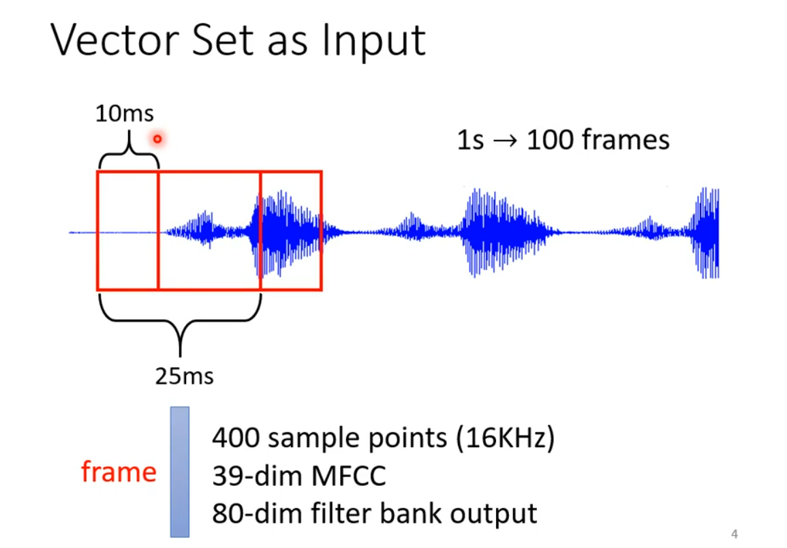

如果每隔 10 ms 提取一帧声学特征，那么 1 s 音频约有 100 帧。每帧表示成一个向量，录音时长不同，输入向量的数量也不同。

### 1.2 以社交网络为例

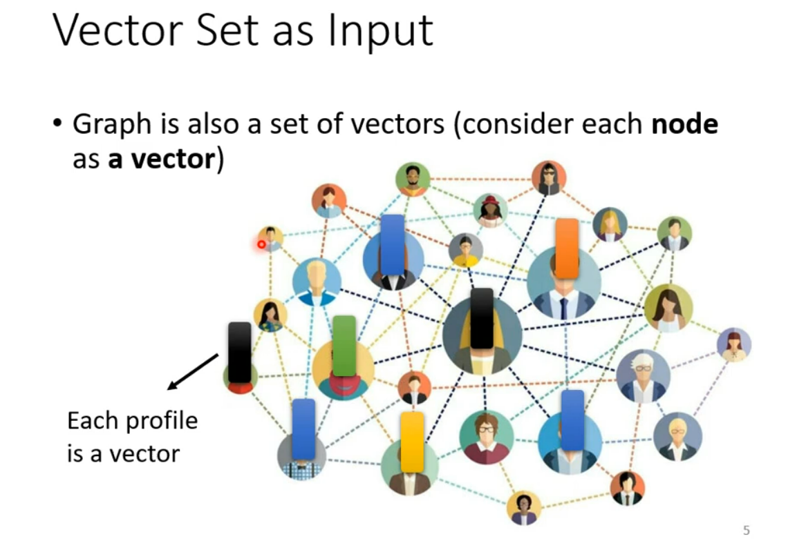

每个人可以表示成一个节点向量，而每个节点的邻居数量不同。这更接近图或集合输入，不一定有自然的先后顺序。如果只聚合相邻节点，可以用图结构限制 Attention 的可见范围；如果全部节点两两关注，则会得到全局信息聚合。

## 2. 输出

Self-Attention 本身通常为每个输入位置输出一个新向量，因此输入有 $n$ 个位置，输出也有 $n$ 个位置。

### 2.1 输出数量

- **Sequence Labeling（序列标注）**：输出数量与输入长度相同。每个位置预测一个 label，例如词性标注。
- **Sequence Classification（序列分类）**：输出一个或多个类别，例如句子情感分类。

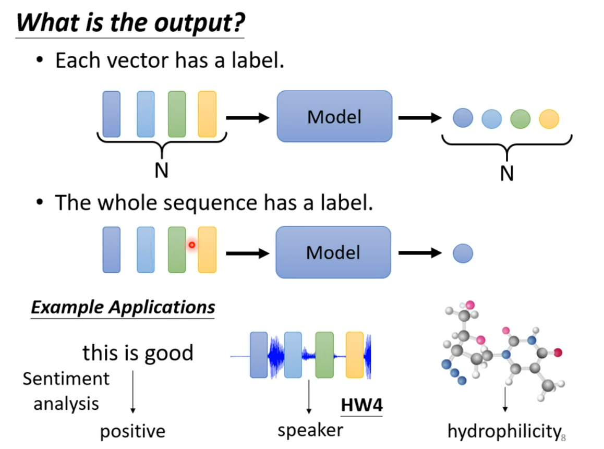

### 2.2 输出长度

在翻译等 Seq2Seq（序列到序列）任务中，输出长度不能由输入长度直接确定。通常由 Decoder 逐步生成，遇到 `<EOS>` 时结束。

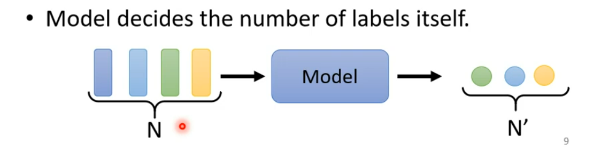

很多 NLP 任务可以改写成“给出输入或问题，生成答案”的形式，但并非所有任务都必须建模成 QA 或 Seq2Seq。

**1. 文法剖析**

把语法树序列化成包含括号、节点标签等的 token 序列，就可以用 Seq2Seq 预测树结构。

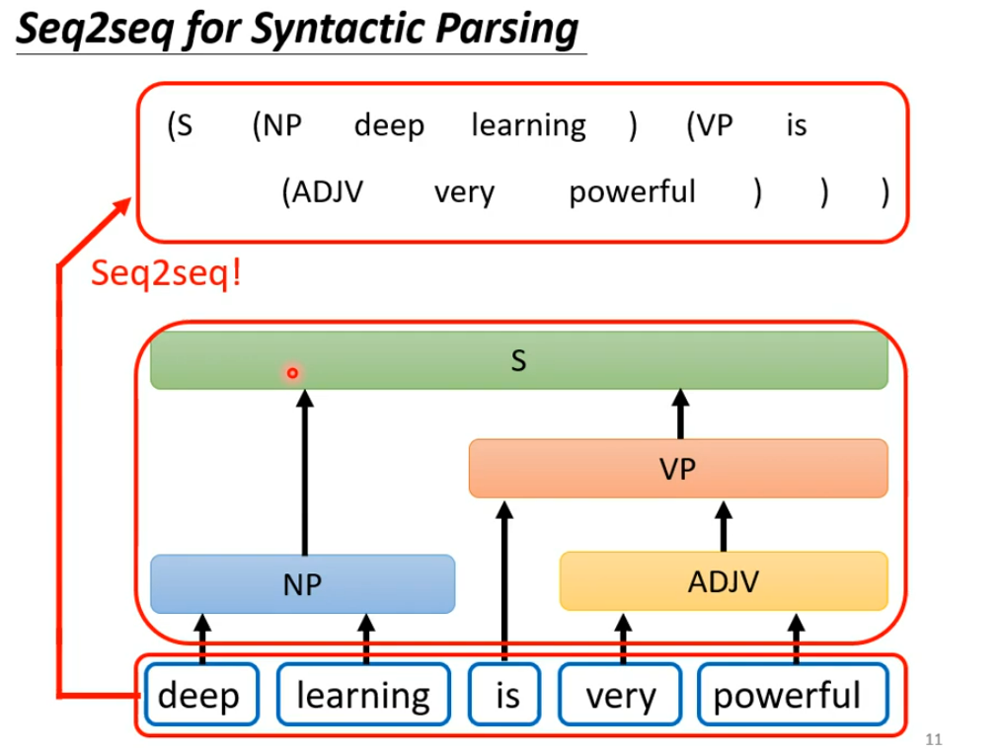

**2. 多标签分类**

可以把标签按约定顺序生成成一个序列，由 `<EOS>` 表示结束。但标签本质上往往是一个集合，生成时需要处理顺序和重复标签。

另一种常见做法是为每个类别**输出独立的 sigmoid 概率**。

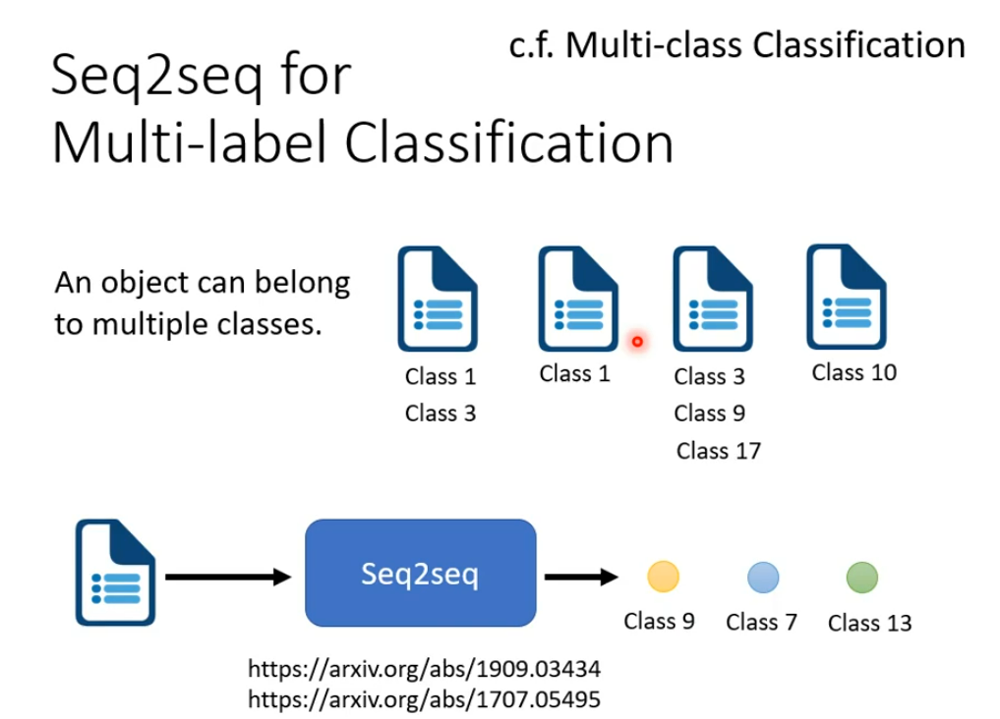

**3. 物体检测**

一张图里的物体数量不固定，可以把类别与边界框编码成序列进行预测，也可以采用集合预测等方式。

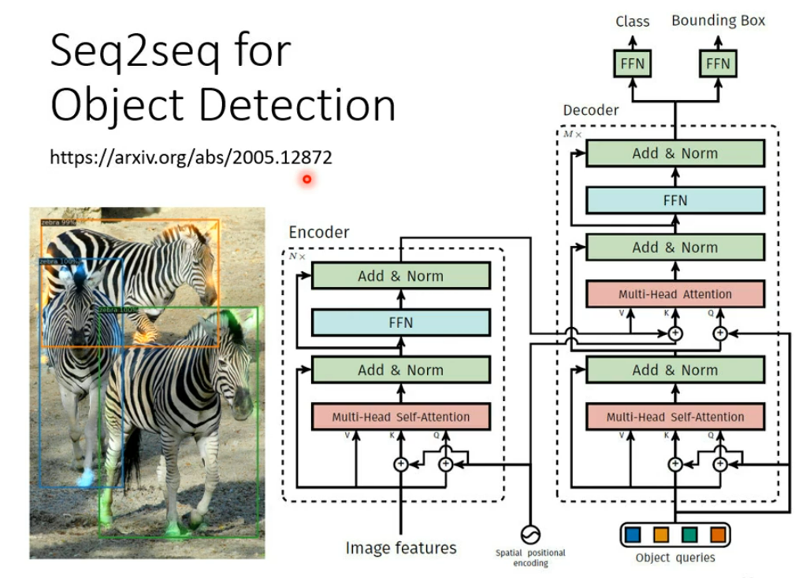

## 3. 基本结构

### 3.1 Sequence Labeling

假设一个句子有两个 `saw` ，一个表示“看见”的过去式，一个表示“锯子”。模型如果不看上下文，就无法判断这个 `saw` 的具体含义。

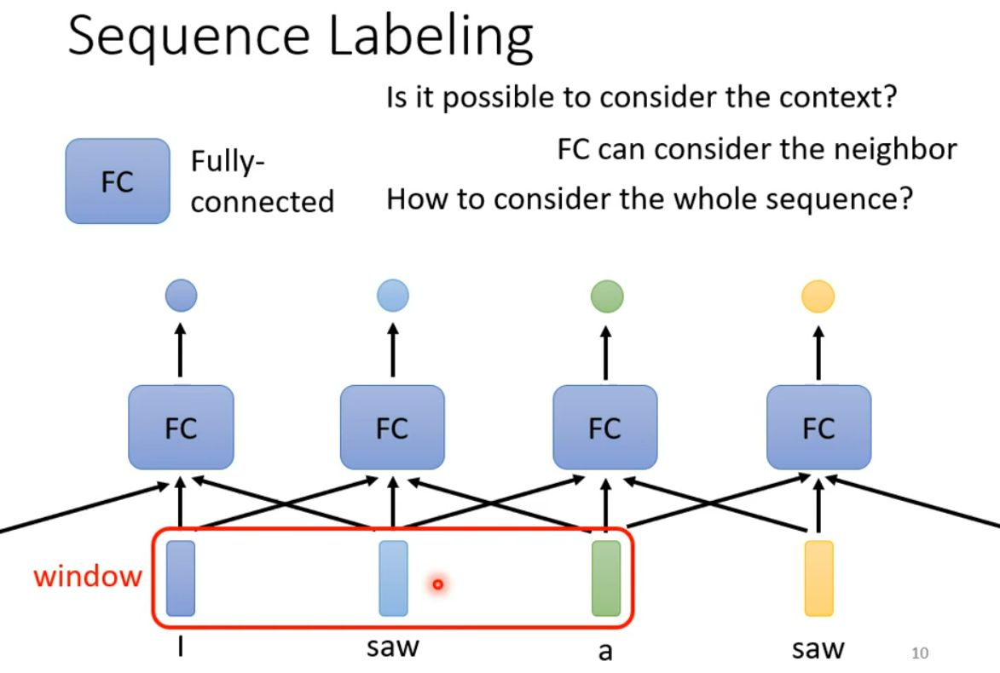

**Q**：怎样让当前位置参考其他位置？

**A**：Self-Attention 为当前位置与各个可见位置计算匹配分数，再按归一化后的权重汇总信息，得到包含上下文的新表示。

### 3.2 多层叠加

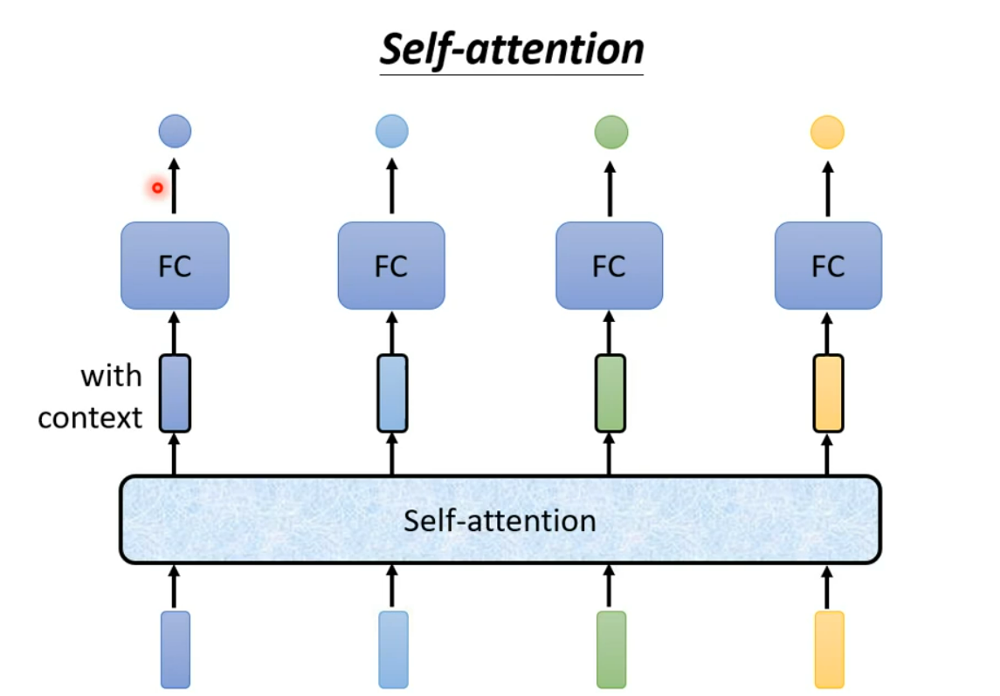

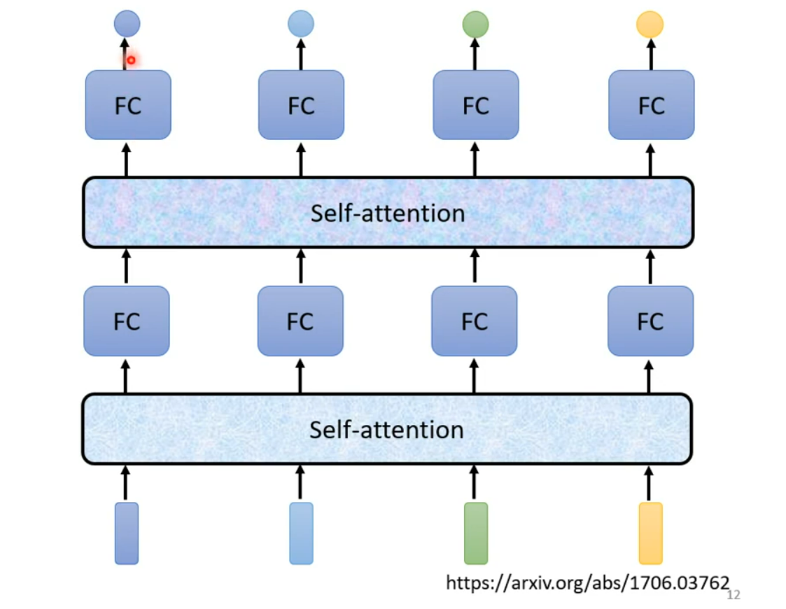

Self-Attention 可以多层叠加。后一层的输入的是前一层已经融合上下文的表示。

## 4. Self-Attention 的运作

本文中的$a^i,q^i,k^i,v^i,b^i$ 都是**列向量**，上标 $i$ 表示位置。$a^i$ 的维度为 $d_{\mathrm{model}}$，$q^i,k^i$ 的维度为 $d_k$，$v^i,b^i$ 的维度为 $d_v$。

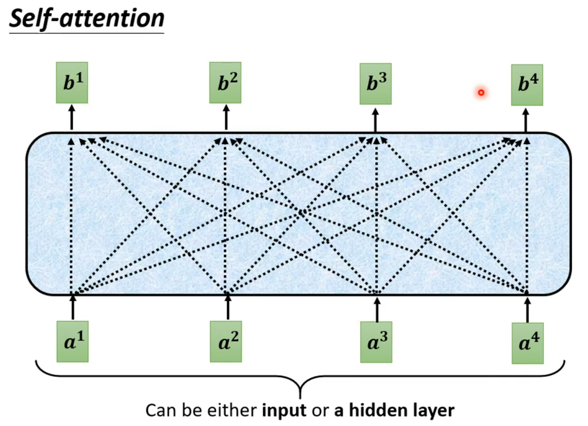

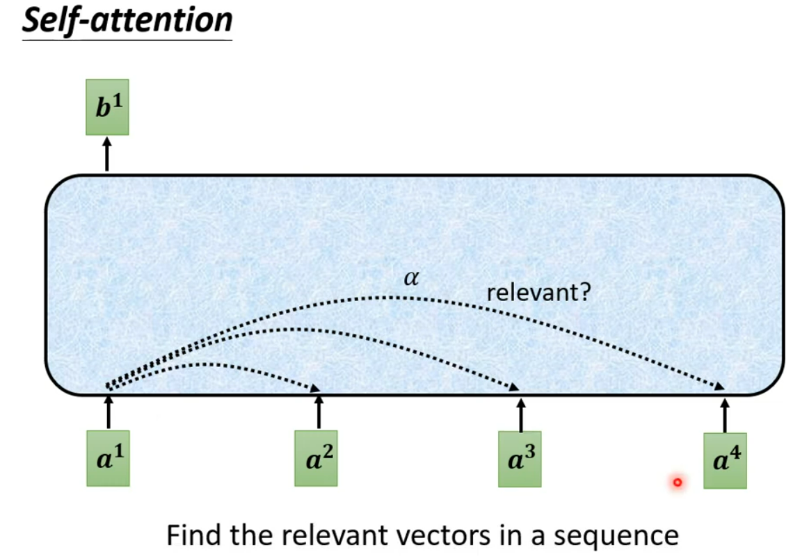

### 4.1 Query、Key 和 Value

每个输入向量通过三组可学习的矩阵生成：

$$
q^i=W^q a^i,\qquad k^i=W^k a^i,\qquad v^i=W^v a^i
$$

其中 $W^q,W^k\in\mathbb R^{d_k\times d_{\mathrm{model}}}$，$W^v\in\mathbb R^{d_v\times d_{\mathrm{model}}}$，和CNN的共享卷积参数一样，所有位置共享这三组参数。

- **Query**：我在找什么？
- **Key**：我有什么特征可以被匹配？
- **Value**：被关注后，我提供什么信息？

### 4.2 注意力分数

第 $i$ 个 Query 与第 $j$ 个 Key 做点积，得到一个值，这个值就是注意力分数：

$$
\alpha_{i,j}=(k^j)^{\mathsf T}q^i
$$

例如，$q^1$ 分别与所有 Key 做乘积，包括自身：
$$
\begin{aligned}
\alpha_{1,1}&=(k^1)^{\mathsf T}q^1\\
\alpha_{1,2}&=(k^2)^{\mathsf T}q^1\\
\alpha_{1,3}&=(k^3)^{\mathsf T}q^1\\
\alpha_{1,4}&=(k^4)^{\mathsf T}q^1
\end{aligned}
$$

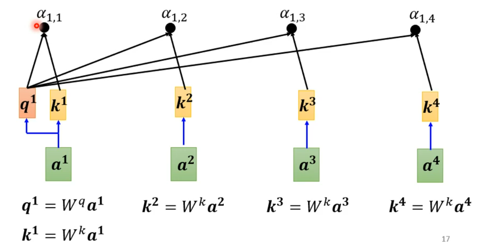

### 4.3 注意力权重

注意力分数先除以 $\sqrt{d_k}$，再用 softmax 归一化：

$$
\alpha'_{i,j}
=\frac{\exp(\alpha_{i,j}/\sqrt{d_k})}
{\sum_{m=1}^{n}\exp(\alpha_{i,m}/\sqrt{d_k})}
$$

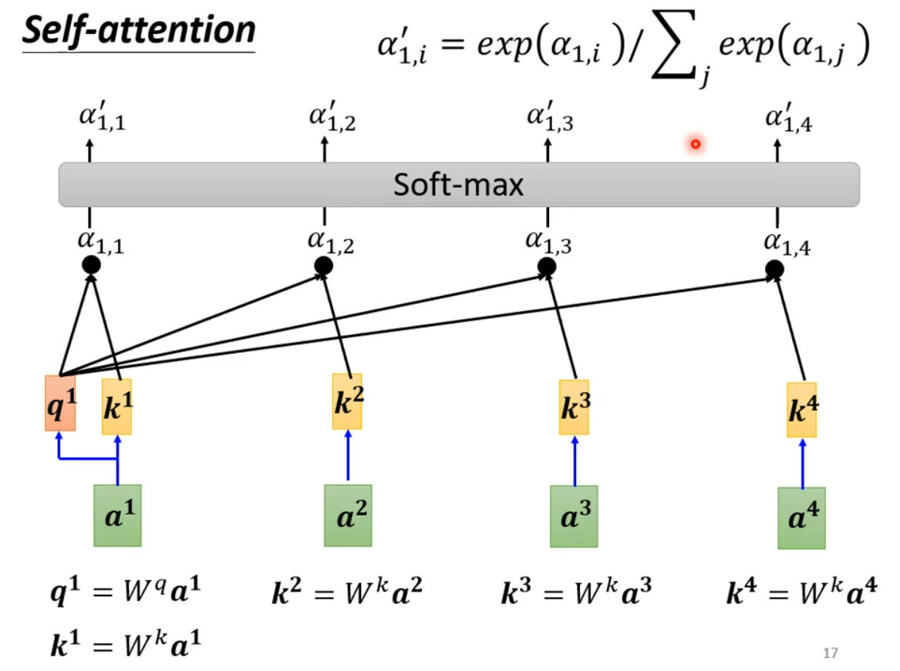

$\alpha_{i,j}$ 是分数，$\alpha'_{i,j}$ 是注意力权重。

**Q**：为什么除以 $\sqrt{d_k}$？

**A**：在各分量独立、均值为 0、方差为 1 的假设下，向量越长，点积的数值越容易变得很大，容易使 softmax 计算出来的结果过于集中、梯度变小。点积的方差为 $d_k$，除以 $\sqrt{d_k}$，点积的方差变为 1，能够使训练保持较好的效果。

### 4.4 加权求和

生成 Value，加权求和得到 $b^i$：

$$
b^i=\sum_{j=1}^{n}\alpha'_{i,j}v^j
$$

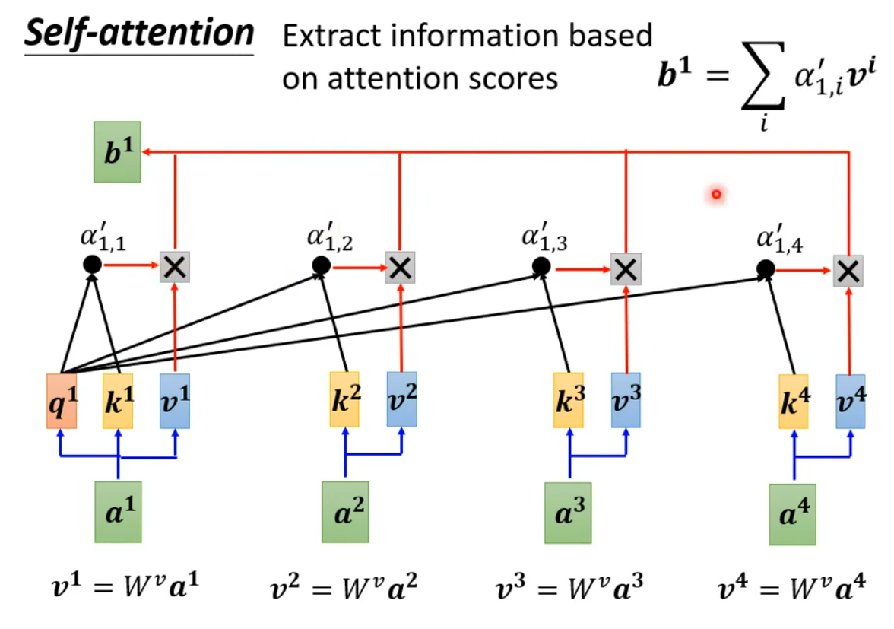

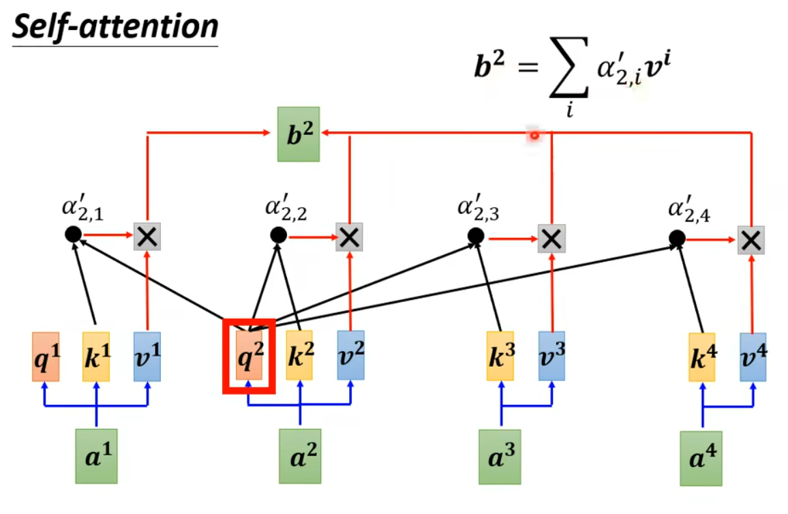

例如，$q^1$ 对四个位置的权重为 0.1、0.6、0.2、0.1，则：
$$
b^1=0.1v^1+0.6v^2+0.2v^3+0.1v^4
$$

下图是两种不同的注意力计算方式，通常采用的是左边红框这种，也是本文所讲的。

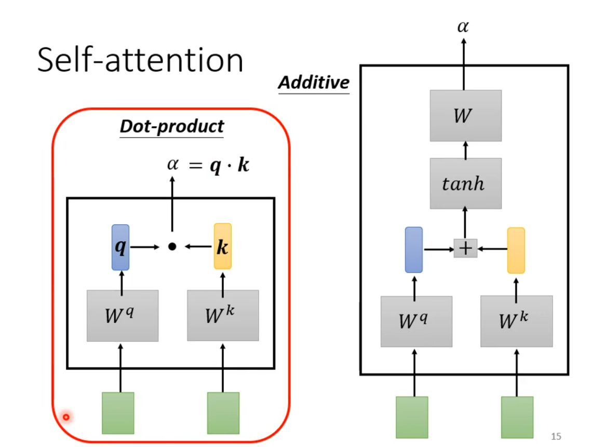

### 4.5 矩阵运算

把输入向量**按列排列**：

$$
X=[a^1,\ldots,a^n]\in\mathbb R^{d_{\mathrm{model}}\times n}
$$

（1）一次生成所有 Query、Key 和 Value：

$$
Q=W^qX,\qquad K=W^kX,\qquad V=W^vX
$$

$Q,K$ 的形状为 $d_k\times n$，$V$ 的形状为 $d_v\times n$。

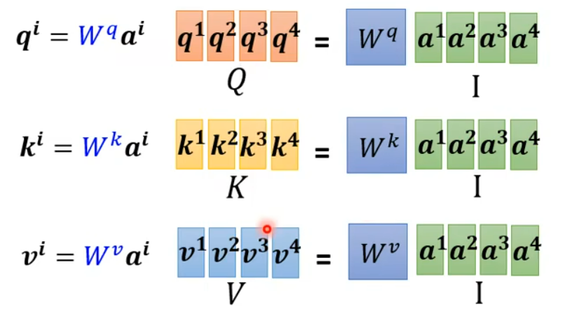

（2）所有匹配分数组成矩阵：

$$
S=K^{\mathsf T}Q\in\mathbb R^{n\times n},\qquad S_{j,i}=\alpha_{i,j}
$$

**第 $i$ 列对应 Query，第 $j$ 行对应 Key**。第一列就是 $q^1$ 与所有 Key 的匹配分数。

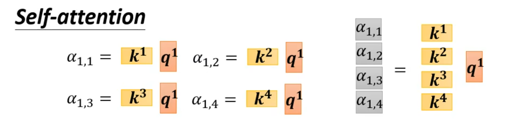

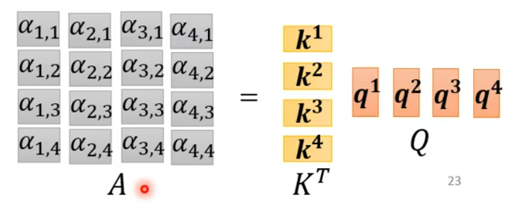

（3）缩放后，对**每一列**做 softmax，得到权重矩阵 $A$：

$$
A=\operatorname{softmax}_{\mathrm{col}}\left(\frac{K^{\mathsf T}Q}{\sqrt{d_k}}\right),\qquad
A_{j,i}=\alpha'_{i,j}
$$

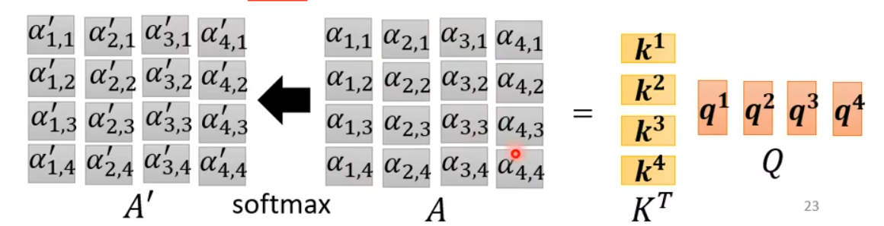

（4）用 Value 矩阵乘以权重矩阵：

$$
B=VA=[b^1,\ldots,b^n]\in\mathbb R^{d_v\times n}
$$

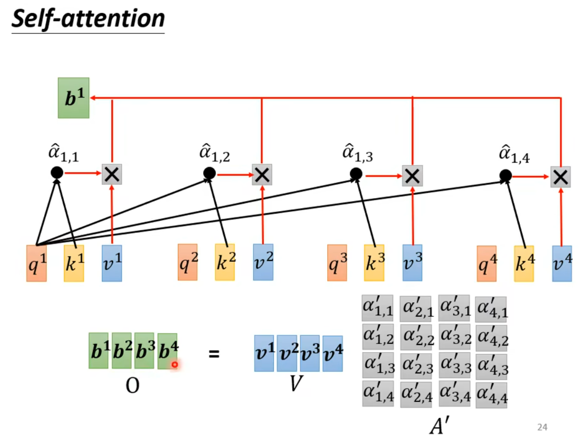

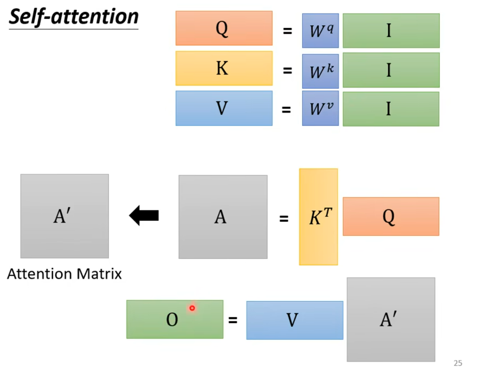

（5）第 $i$ 列就是融合上下文后的 $b^i$。整个计算可以合写为：

$$
B=V\operatorname{softmax}_{\mathrm{col}}\left(\frac{K^{\mathsf T}Q}{\sqrt{d_k}}\right)
$$

需要在训练中学习的是 $W^q,W^k,W^v$，权重 $A$ 根据当前输入计算。

若有位置需要屏蔽，就在 softmax 前将对应分数设为 $-\infty$；详见 [Transformer 的 Mask 部分](transformer.md)。

## 5. Multi-Head Self-Attention

### 5.1 Multi-Head

多个头使用**不同的投影参数**，学习**不同的关注关系**，最后拼接各头输出，再做线性变换。

每个头的关注内容是在训练中学习的，不是人为固定的“语法头”或“语义头”。

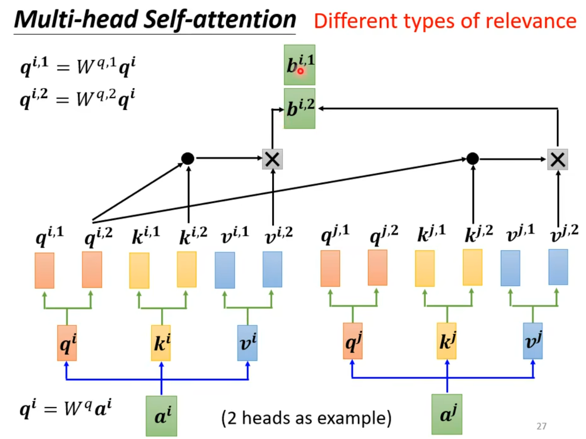

第 $r$ 个头得到：

$$
q^{i,r}=W^{q,r}q^i,\qquad
k^{i,r}=W^{k,r}k^i,\qquad
v^{i,r}=W^{v,r}v^i
$$

每个头按前面的步骤独立计算权重，并得到 $b^{i,r}$。例如，第 $r$ 个头的 Query/Key 维度为 $d_{k,r}$，则：

$$
\alpha'^{(r)}_{i,j}
=\frac{\exp\bigl((k^{j,r})^{\mathsf T}q^{i,r}/\sqrt{d_{k,r}}\bigr)}
{\sum_{m=1}^{n}\exp\bigl((k^{m,r})^{\mathsf T}q^{i,r}/\sqrt{d_{k,r}}\bigr)},\qquad
b^{i,r}=\sum_{j=1}^{n}\alpha'^{(r)}_{i,j}v^{j,r}
$$

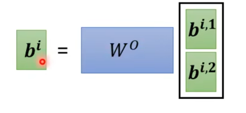

将同一位置的各头输出沿**特征维度**拼接成列向量，再做输出投影：

$$
b^i=W^O
\begin{bmatrix}
b^{i,1}\\
\vdots\\
b^{i,h}
\end{bmatrix}
$$

若每个头输出 $d_{v,\mathrm{head}}$ 维，则 $W^O\in\mathbb R^{d_{\mathrm{model}}\times hd_{v,\mathrm{head}}}$。例如 8 个头各输出 64 维，拼接后是 512 维，输出会混合各个头的信息。

### 5.2 Positional Encoding

Self-Attention 本身不提供 token 的先后顺序。例如“我喜欢你”和“你喜欢我”包含相同的 token，顺序却改变了含义。因此需要加入位置信息。

原始 Transformer 将 token embedding 与同维度的位置编码相加，详见 [Transformer 输入处理](transformer.md)。

### 5.3 图像

把图像 patch 或各位置的特征映射成向量，也可以使用 Self-Attention，并加入图像位置信息。

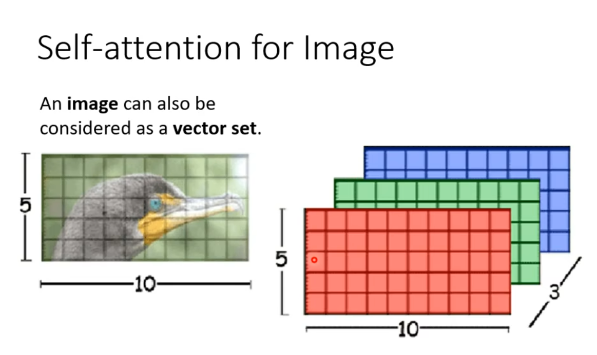

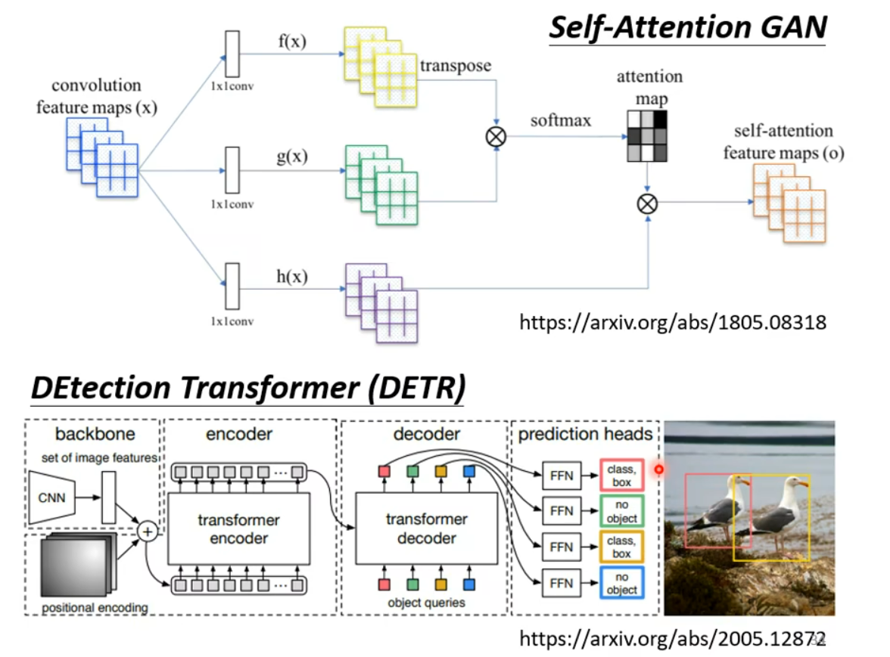

## 6. 模型对比

### 6.1 Self-Attention 与 CNN

CNN 使用卷积核在局部聚合信息，其感受野由卷积核、步幅、膨胀率和网络深度等决定。

全局 Self-Attention 可以在一层内连接任意两个可见位置，其权重会根据输入动态变化。

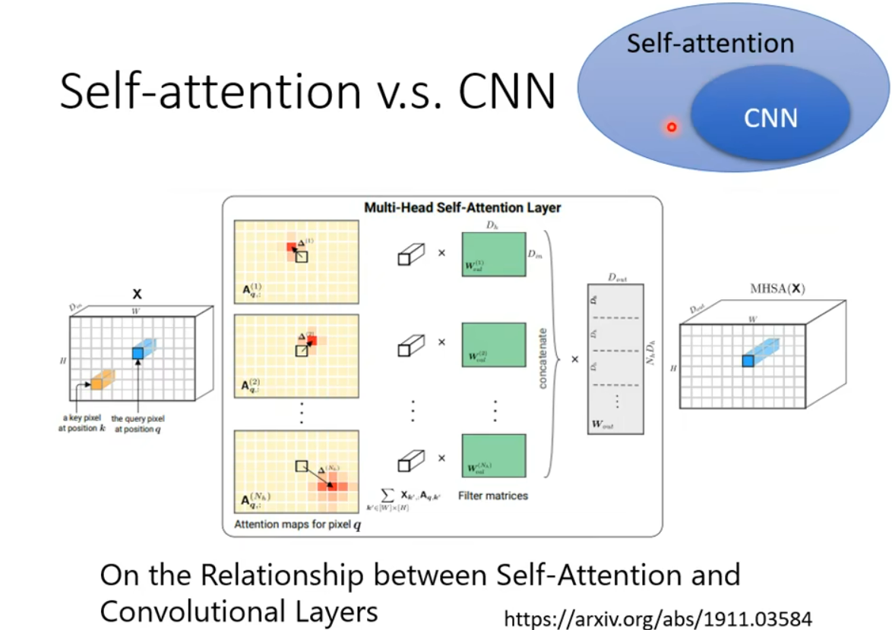

两者都可以并行处理不同位置。CNN 的局部性与权重共享会告诉模型：**邻近像素往往有关联，同一种局部特征出现在不同位置，也可以用相同的方法识别**，Self-Attention 的关注范围更灵活：**一个位置可以根据当前输入，直接参考其他位置**，但两种模型实际效果与样本量、训练方法和任务有关。

### 6.2 Self-Attention 与 RNN

单向 RNN 的当前状态依赖过去状态，双向 RNN 可以结合前后文。RNN 是顺序计算，不能像一次 Self-Attention 那样并行计算所有位置。

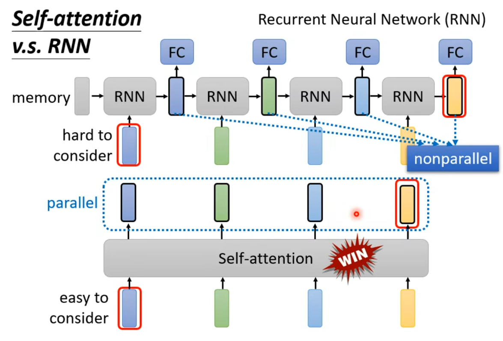

**Q**：Transformer 可以并行，就能一次生成整句话吗？

**A**：训练时可以并行计算各位置的预测，自回归推理时，下一步依赖上一步生成的 token，还是需要逐步生成。

扩展阅读：[Transformers are RNNs: Fast Autoregressive Transformers with Linear Attention](https://arxiv.org/abs/2006.16236)。这篇论文讨论了特定的线性注意力如何写成递归形式，并不表示标准 softmax Self-Attention 与普通 RNN 完全等价。

### 6.3 Self-Attention 与 GNN

GNN 通常按图的边聚合邻居信息，多层叠加后可以获取更远节点的信息。

图注意力可以为邻居分配动态权重。全局 Self-Attention 可以理解为在所有位置两两连接的结构上进行信息聚合。

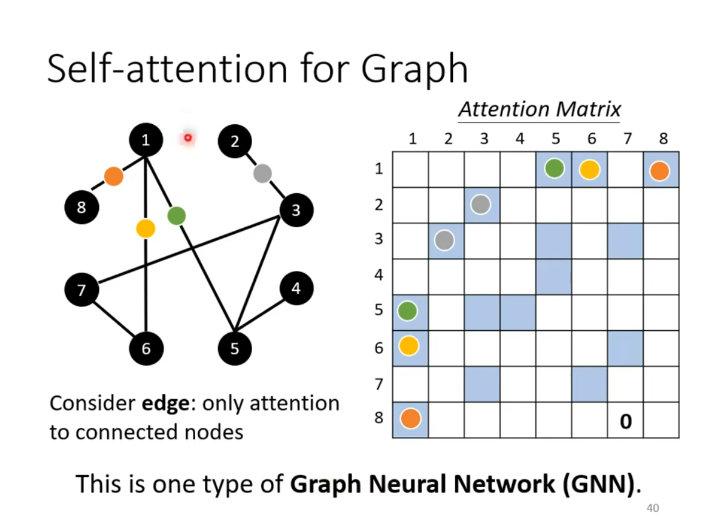

如果任务需要保留原图结构，就应通过邻接关系、mask 或结构编码等方式告诉模型哪些节点存在联系。

## 7. 计算量

标准稠密 Self-Attention 要计算所有 token 对。分数和权重矩阵的形状为 $n\times n$。单头打分与加权求和的计算复杂度为：

$$
O\bigl(n^2(d_k+d_v)\bigr)
$$

显式保存完整注意力矩阵的空间开销为 $O(n^2)$。高效实现可以减少存储开销，但稠密注意力的两两交互计算仍随序列长度平方增长。

常见改进包括：

- 局部窗口
- 稀疏连接
- 低秩近似
- 线性 Attention

## 8. 学会了吗？maybe可以尝试一下自行推导按行计算

### 1. 生成 Query、Key 和 Value

设第 $i$ 个输入是行向量 $a^i\in\mathbb R^{1\times d_{\mathrm{model}}}$：
$$
 q^i=a^iW^Q,\qquad k^i=a^iW^K,\qquad v^i=a^iW^V
$$
其中：
$$
 W^Q,W^K\in\mathbb R^{d_{\mathrm{model}}\times d_k}, \qquad W^V\in\mathbb R^{d_{\mathrm{model}}\times d_v} 
$$
因此，$q^i,k^i$ 是 $1\times d_k$ 的行向量，$v^i$ 是 $1\times d_v$ 的行向量。

### 2. 计算匹配分数

第 $i$ 个 Query 与第 $j$ 个 Key 做点积：
$$
 \alpha_{i,j}=q^i(k^j)^{\mathsf T} 
$$
这里的形状是：
$$
(1\times d_k)(d_k\times1)=1\times1
$$
所以得到一个标量，表示两个位置的匹配分数。

### 3. 缩放并归一化

对于同一个 Query，将它与所有 Key 的分数除以 $\sqrt{d_k}$，再做 softmax：
$$
\alpha'_{i,j} = \frac{\exp(\alpha_{i,j}/\sqrt{d_k})} {\sum_{m=1}^{n}\exp(\alpha_{i,m}/\sqrt{d_k})}
$$
得到的权重非负，而且：
$$
 \sum_{j=1}^{n}\alpha'_{i,j}=1 
$$

### 4. 对 Value 加权求和

$$
 b^i=\sum_{j=1}^{n}\alpha'_{i,j}v^j 
$$

例如权重为 0.1、0.6、0.2、0.1，则：
$$
 b^1=0.1v^1+0.6v^2+0.2v^3+0.1v^4 
$$
输出 $b^i$ 仍是行向量，形状为 $1\times d_v$。

### 5. 合并成矩阵计算

把输入向量按行排列：
$$
X= \begin{bmatrix} a^1\\ a^2\\ \vdots\\ a^n \end{bmatrix} \in\mathbb R^{n\times d_{\mathrm{model}}} 
$$
一次生成全部 Query、Key、Value：
$$
 Q=XW^Q,\qquad K=XW^K,\qquad V=XW^V 
$$
所有匹配分数组成：
$$
 S=QK^{\mathsf T}\in\mathbb R^{n\times n} 
$$
**第 $i$ 行对应 Query，第 $j$ 列对应 Key**，即 $S_{i,j}=\alpha_{i,j}$。对每一行做 softmax：
$$
 A=\operatorname{softmax}_{\mathrm{row}} \left(\frac{QK^{\mathsf T}}{\sqrt{d_k}}\right) 
$$
最后乘以 Value 矩阵：
$$
B=AV = \begin{bmatrix} b^1\\ b^2\\ \vdots\\ b^n \end{bmatrix} \in\mathbb R^{n\times d_v}
$$
**恭喜你推导出了原论文的公式^_^：**
$$
\boxed{ \operatorname{Attention}(Q,K,V) = \operatorname{softmax} \left(\frac{QK^{\mathsf T}}{\sqrt{d_k}}\right)V }
$$
这里 softmax 沿每行的 Key 位置计算

## 9. 参考资料

[【機器學習2021】自注意力機制 (Self-attention) (上)](https://www.youtube.com/watch?v=hYdO9CscNes)

[【機器學習2021】自注意力機制 (Self-attention) (下)](https://www.youtube.com/watch?v=gmsMY5kc-zw)

[Attention Is All You Need](https://arxiv.org/abs/1706.03762)

[Transformers are RNNs](https://arxiv.org/abs/2006.16236)
