# Transformer

[返回 04 · Transformer 基础](../04-Transfomer基础.md)

### 1. 总体结构

本质：**输入一段序列，输出一段序列**。不知道要输出有多长，由机器自己决定输出的长度。

采用 **Encoder-Decoder 架构**，在 **[《Attention Is All You Need》](https://arxiv.org/pdf/1706.03762.pdf)** 中，Encoder 层由 6 个 Encoder Layer 堆叠在一起，Decoder 层也由 6 个 Decoder Layer 堆叠在一起。

每一个Encoder 和 Decoder Layer 的结构如图：

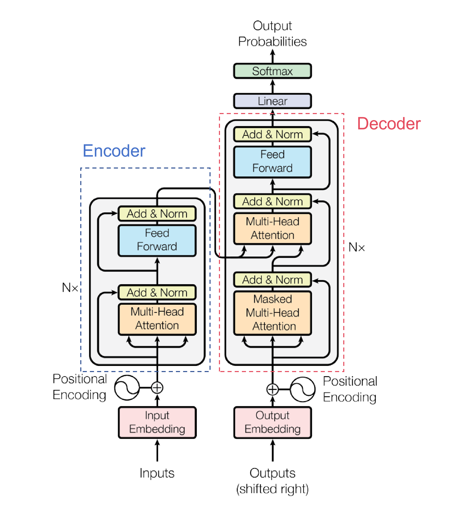

- **Encoder**：包含两层：**Multi-Head Attention 层**和 **FFN 层**。
- **Decoder**：包含三层：**Masked Multi-Head Attention 层**、**Multi-Head Attention 层**和 **FFN 层**。

  **Q**：为什么 Decoder 第一层需要masked但第二层不需要？

  **A**：**第一层**在预测当前位置时，不能偷看后面的答案，Q、K、V 都来自 Decoder 自己当前这一层的输入。比方说在机器翻译任务中，目标序列是：
  ```
  <BOS> I love you <EOS>
  ```
  训练时虽然整句话都一次性送进 Decoder，但预测 `love` 时，只能看到：
  ```
  <BOS> I
  ```
  不能看到：
  ```
  you <EOS>
  ```
  
  而**第二层 Multi-Head Attention** 实际上是 **Cross-Attention**，Q 来自 Decoder，K、V来自 Encoder，也就是说 Decoder 此时是在“查询输入句子的信息”

  Encoder 输入：
  ```
  我 喜欢 你
  ```
  而 Decoder 正在生成：
  ```
  I love ...
  ```
  此时 Decoder 可以看 Encoder 的所有输出（这个时候句子已经被处理过了，但为了方便理解还是用原句举例）：
  ```
  我    喜欢    你
  ↑      ↑      ↑
  ```
  所有位置都可以看到。

  因此，Encoder 的第二层attention是为了帮助当前节点获取到当前需要关注的重点内容。


**Encoder 和 Decoder 的差别**

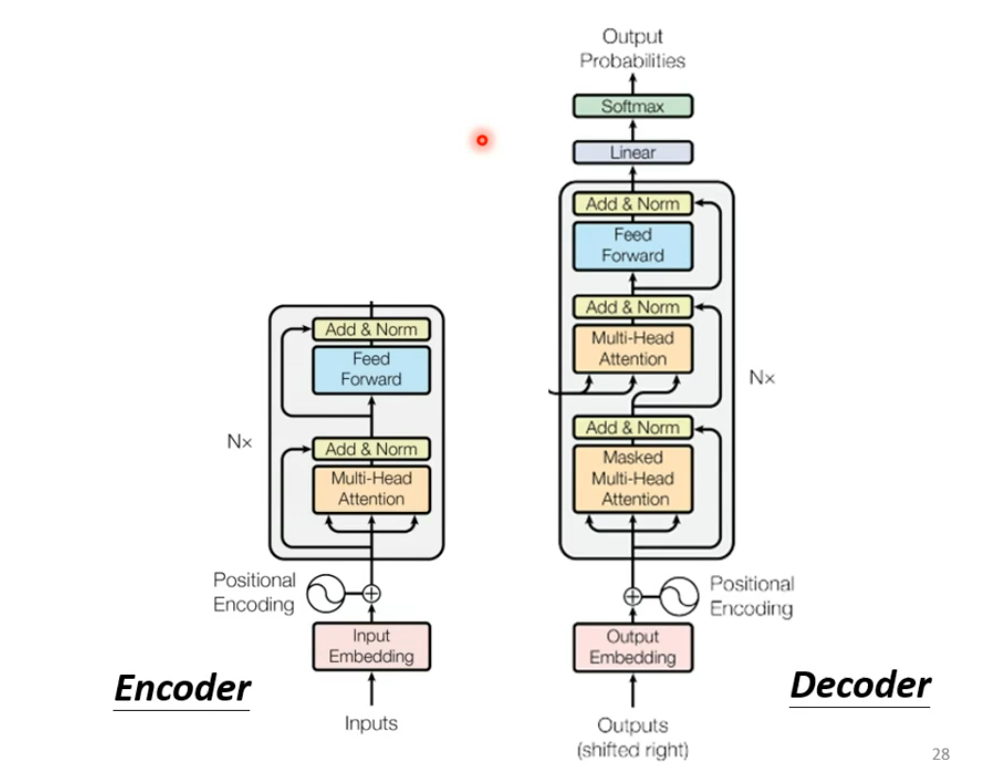

把中间遮起来之后发现高度相似

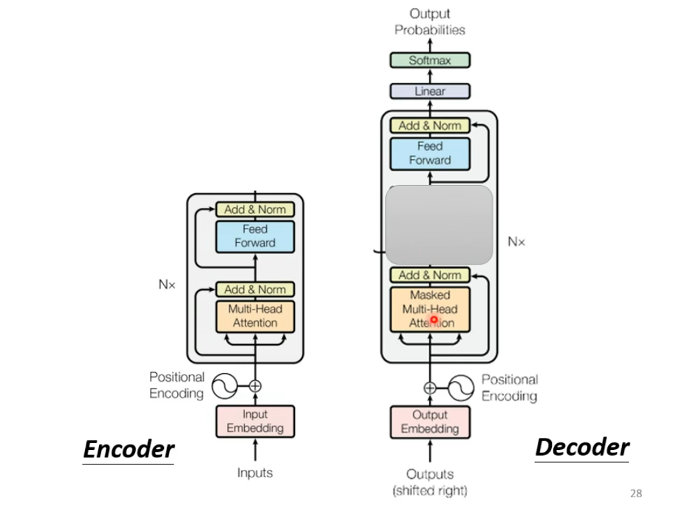


### 2. Encoder

一个 Transformer Encoder Layer（编码器层）可以理解为图中的一个Block，每个 Block 做 Self-attention，得到的 vector 会丢到 FFN 里面，得到 Block 的输出。而 Encoder 由多个这样的 Block 堆叠而成。

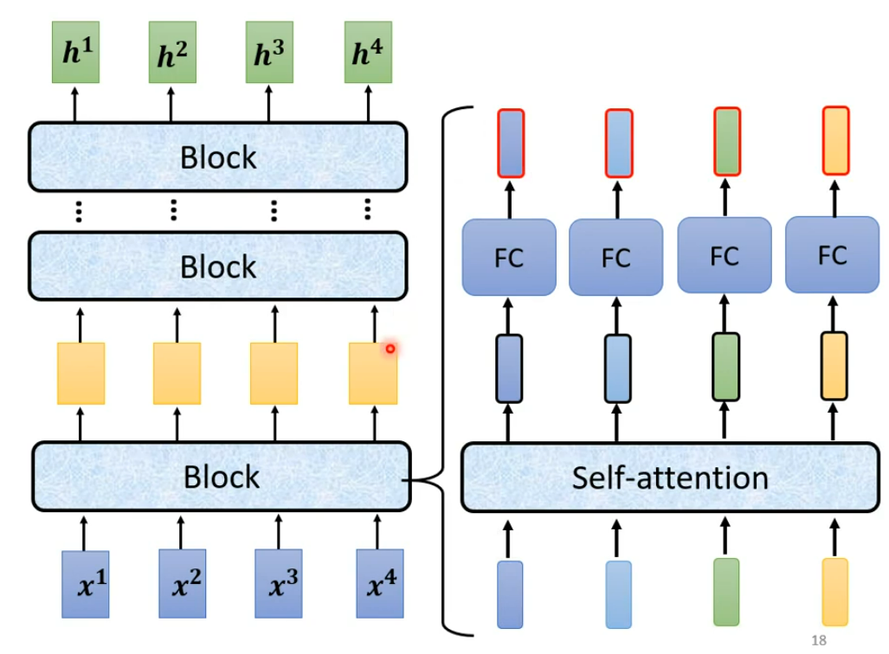


#### 2.1 输入处理

$$
\boxed{X = \text{Token Embedding} + \text{Positional Encoding}}
$$
用embedding 结果加上位置编码的结果作为输入。


##### 2.1.1 embedding

模型会对输入的数据进行 embedding 操作，embedding 结束后将其输入到 encoder 层。


##### 2.1.2 Positional Encoding

因为 Self-Attention 本身只是在比较各个 token 之间的关系，它并不知道“谁在前、谁在后”。比如：
```
我 喜欢 你    和    你 喜欢 我
```
如果完全不加位置信息，只看 token embedding，模型很难区分这两个序列的顺序差异。

因此transformer 给 encoder 层和 decoder 层的输入添加了**Positional Encoding**（位置编码），用来告诉模型：**每个 token 在序列中的位置是什么**。

原始 Transformer 使用的是固定的正弦（偶数位置）、余弦（奇数位置）位置编码：
$$
PE(pos, 2i) = \sin\left(\frac{pos}{10000^{2i/d_{\text{model}}}}\right)
$$

$$
PE(pos, 2i+1) = \cos\left(\frac{pos}{10000^{2i/d_{\text{model}}}}\right)
$$

- $pos$：token 的位置，比如第 0、1、2 个
- $i$：向量维度编号
- $d_{\text{model}}$：embedding 的维度


不过需要注意：现代 Transformer 不一定都使用原始的 sin/cos Positional Encoding，也有 learned positional embedding、RoPE 等方法。但作用本质上都是：**让模型感知 token 的位置和相对顺序**。


#### 2.2 Self-Attention 和 Multi-Head Attention

详见 [Self-Attention](Self-Attention.md)，其中包含 Query/Key/Value、缩放点积注意力、矩阵形状与多头拼接的完整推导。

在 Encoder 中，Query、Key、Value 都来自当前子层的输入。多头输出会投影回 $d_{\mathrm{model}}$ 维，再进入残差连接与 LayerNorm。

#### 2.3 Layer Normalization

Normalization（归一化）的本质：**把输入转化为均值为0方差为1的数据**，这样能够使激活函数更好地工作。


**Q**：Layer Normalization 和 Batch Normalization有什么区别？

**A**：

**Batch Normalization（BN）** 是对同一个 feature 在一个 batch 的不同样本上做归一化。
**Layer Normalization（LN）** 是对同一个样本（或 token）内部的不同 feature dimensions 做归一化。


比如一个 batch 里有 3 个样本，每个样本有 4 个 feature：
$$
\
X=
\begin{bmatrix}
x_{11} & x_{12} & x_{13} & x_{14}\\
x_{21} & x_{22} & x_{23} & x_{24}\\
x_{31} & x_{32} & x_{33} & x_{34}
\end{bmatrix}
$$
那么：
- **BatchNorm** 会“竖着”统计，比如对第一列 $x_{11},x_{21},x_{31}$ 算均值和方差。
- **LayerNorm** 会“横着”统计，比如对第一行 $x_{11},x_{12},x_{13},x_{14}$ 算均值和方差。

### 2.3 Residual Connection

Residual Connection（残差连接）的作用是**改善梯度传播**，可以理解为不让一层网络把原来的信息完全覆盖掉，而是把这一层的输出和原输入直接相加。
$$
{y=x+F(x)}
$$
**Q**：为什么要这么做？

**A**：因为这样网络就算某一层学得不好，原始信息 $x$ 还可以直接保留下来，不会完全丢失。


在 Transformer 里，残差连接主要出现在两个地方（后面都需要跟一次 LayerNorm）。

1. Self-Attention 后：
   $$
   z=x+\operatorname{SelfAttention}(x)
   $$

   $$
   z'=\operatorname{LayerNorm}(z)
   $$

2. FFN 后：
   $$
   y=z'+\operatorname{FFN}(z')
   $$

   $$
   y'=\operatorname{LayerNorm}(y)
   $$


原始 Transformer Encoder 的 **Post-LN** 结构如图，以 Self-Attention 层后的残差连接为例：

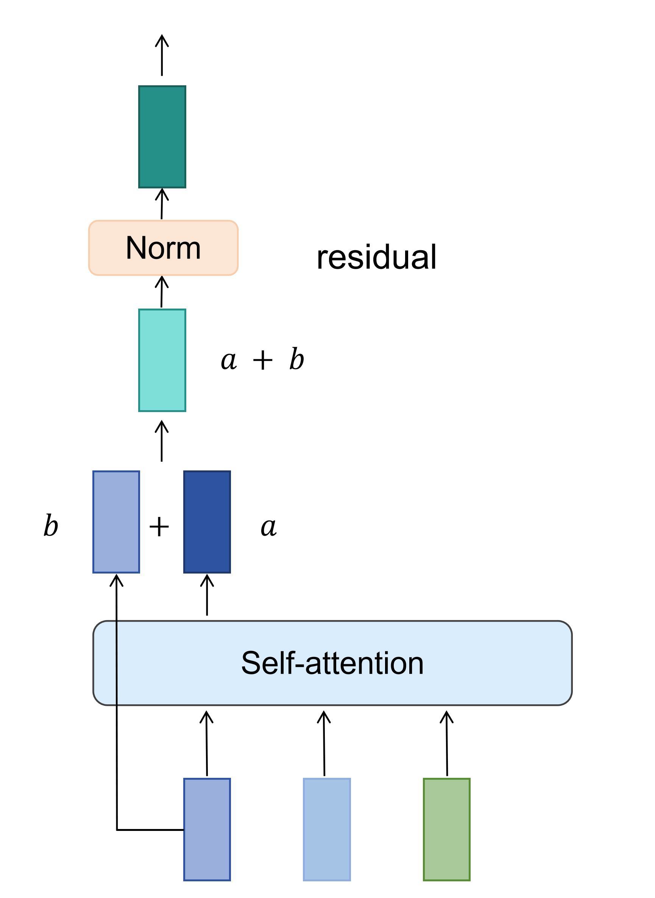
$$
z=\operatorname{LayerNorm}(x+\operatorname{SelfAttention}(x))
$$
FFN层后也同理。


### 2.4 Feed Forward Neural Network

一个 token 经过 Self-Attention 后，已经融合了其他 token 的信息。接下来 FFN 要做的事情，就是**对这个 token 自己的表示进一步加工**。

FC（Fully Connected Layer） 是一个全连接层，FFN（前馈神经网络） 通常是由两个 FC 加一个激活函数组成的小网络。

可以这么理解：

```
输入 x
  ↓
第一个 FC
把维度扩大，让模型有更大的特征空间进行处理
  ↓
激活函数
加入非线性，让模型能够学习更复杂的关系
  ↓
第二个 FC
把维度重新缩回原来的大小
  ↓
输出 y
```


#### 2.4.1 FC

**全连接层**，也常称为 Linear Layer，通过
$$
y=xW+b
$$
对输入特征进行线性变换。

其中：

- $x$：输入向量
- $W$：权重矩阵
- $b$：偏置
- $y$：输出向量

通过 $W$ 的维度，可以控制输出的向量维度。

假设现在有一个 token 的表示：
$$
x= [x_1,x_2,x_3]
$$
我们希望把这个 3 维向量变成一个 4 维向量。那么FC 会**让每一个输出维度都和所有输入维度发生连接**，如图：

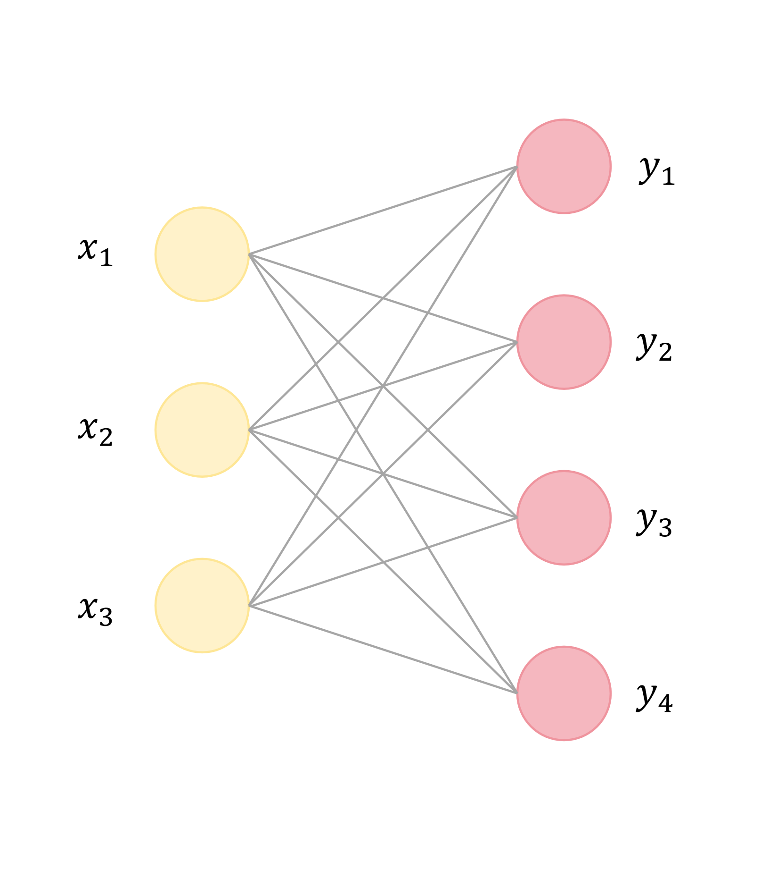

#### 2.4.2 FFN

FFN 主要是将单个 token 内部的 feature 进行非线性变换，每个 token 都独立经过同一个 FFN。

经典 Transformer 中：
$$
FFN(x)=\operatorname{ReLU}(xW_1+b_1)W_2+b_2
$$


**Q**：为什么要先扩大维度，再缩回来？

**A**：扩大是为了让信息能够在更丰富的特征空间中进行非线性变换，缩回是为了让维度变回 $d_{\text{model}}$，方便后面的残差连接。


**Q**：为什么要加激活函数？

**A**：如果没有激活函数，就不能真正增加模型的非线性表达能力。

如果没有 ReLU，假设：

$$ FFN(x)=(xW_1+b_1)W_2+b_2 $$

把它展开：

$$ FFN(x)=xW_1W_2+b_1W_2+b_2 $$

令：

$$W'=W_1W_2 ,  b'=b_1W_2+b_2$$
那么：

$$ FFN(x)=xW'+b' $$

会发现两个 FC 连起来，还是相当于一个 FC，本质上仍然只是一个线性变换。


### 3. Decoder

#### 3.1 Autoregressive

Decoder 一方面接收已经生成的 token 作为自身输入，另一方面通过 Cross-Attention 使用 Encoder 的输出。

Decoder 使用 `<BOS>` 作为生成的起始 token，并结合 Encoder 的输出开始生成。

每一步 Decoder 都会根据已经生成的 token 和 Encoder 的输出，预测下一个 token。

在自回归 Decoder 的**推理阶段**，模型不会预先知道最终要生成多少个 token。它会一个 token 一个 token 地生成，直到生成特殊的结束符 `<EOS>`，表示序列结束。

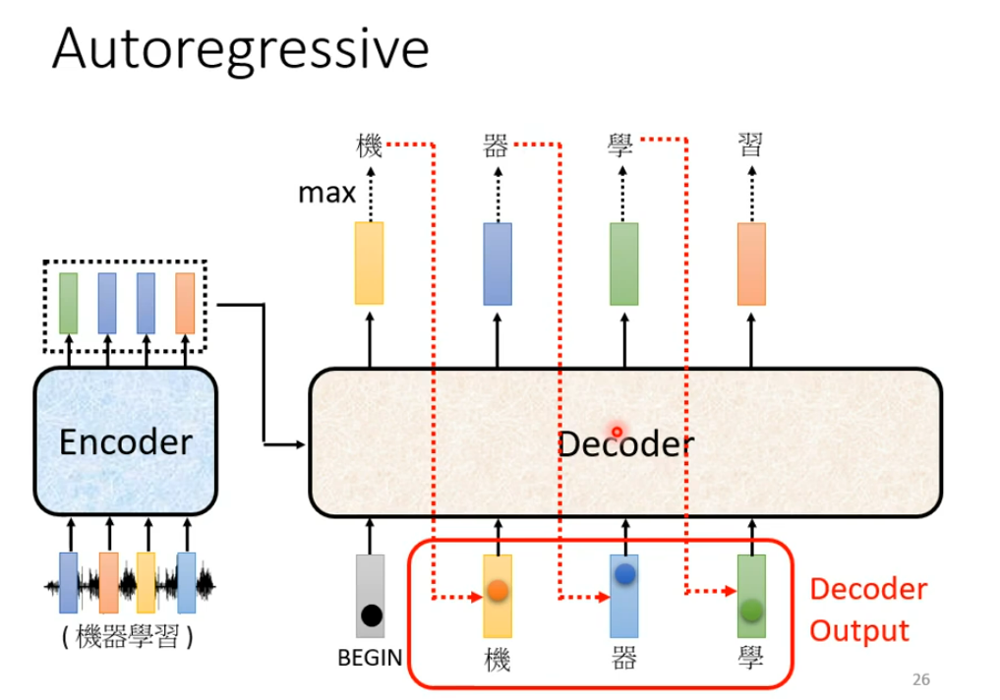

#### 3.2 Non-autoregressive(NAT)

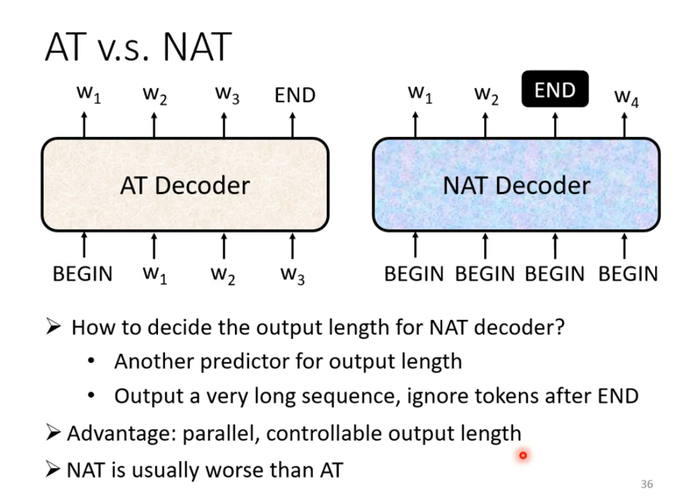

丢一堆BEGIN，输出结果。


**怎么知道应该输入多少BEGIN？** 解决方法：

1.设一个classify，输出一个数字，为输出长度。

2.假设长度不超过多少，输入上限个BEGIN，看输出中什么地方输出了END，作为结束，丢弃END后面的。


- 好处：平行化、可控的输出长度
- 坏处：输出质量比AT差

#### 3.3 Masked Multi-Head Attention

Transformer 模型里面涉及两种 mask：

**Padding Mask**：屏蔽补齐出来的 `<PAD>`。

**Sequence Mask**：屏蔽未来的 token。

可以理解为：**Padding Mask 解决“哪些位置是无效的”；Sequence Mask 解决“哪些位置现在还不能看”**。


##### 3.3.1 Padding Mask

一个 batch 里的句子长度通常不同，但为了组成矩阵，需要补成相同长度。例如：

```
句子1：我 喜欢 机器 学习
句子2：我 喜欢 NLP
句子3：你好
```
补齐后可能得到：
```
我    喜欢    机器    学习
我    喜欢    NLP    <PAD>
你好  <PAD>   <PAD>   <PAD>
```

`<PAD>` 本身只是为了让张量长度一致，**没有实际语义**。所以 Self-Attention 在计算时，不应该关注这些位置。

Attention 原本计算：
$$
 \text{Attention}(Q,K,V) = \text{softmax} \left( \frac{QK^T}{\sqrt{d_k}} \right)V 
$$
加入 Mask 后：
$$
 \text{Attention}(Q,K,V) = \text{softmax} \left( \frac{QK^T}{\sqrt{d_k}}+M \right)V 
$$
对于需要屏蔽的位置，把 $M$ 设成非常小的数，例如 \[ -\infty \]，于是该位置的 Attention Weight 就变成 0，相当于完全不看它。


##### 3.3.2 Sequence Mask

主要用于 **Decoder 的 Masked Self-Attention**

通俗地理解，就是**当前位置只能看自己以及左边已经出现的 token，不能看右边未来的 token**。

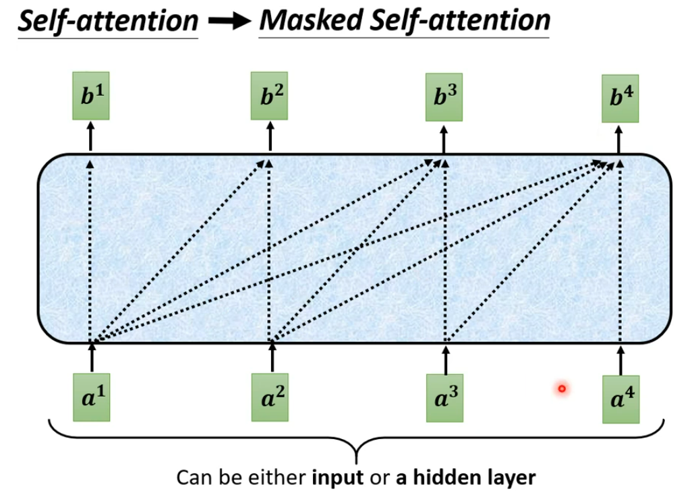

假设正确答案是：
```
<BOS> I love you
```
训练时为了提高效率，这几个 token 可以一次性送进 Decoder：
```
<BOS>    I    love    you
```

但这就产生了一个问题：当模型正在预测 `love` 的时候，**不能提前看到后面的 `you`**。所以需要 Sequence Mask。例如：
```
               可以关注的位置
             BOS    I    love   you

BOS           ✓     ×      ×      ×
I             ✓     ✓      ×      ×
love          ✓     ✓      ✓      ×
you           ✓     ✓      ✓      ✓
```

即此时 Mask 矩阵为：
$$
M=
\begin{bmatrix}
1&0&0&0\\
1&1&0&0\\
1&1&1&0\\
1&1&1&1
\end{bmatrix}
$$


#### 3.4 Cross-Attention

Decoder 在生成当前 token 时，去 **Encoder 的输出**里查找**现在最需要参考哪些输入信息**。

 Cross-Attention 中，**$q$ 来自 Decoder**，而 **$k,v$ 来自 Encoder**。

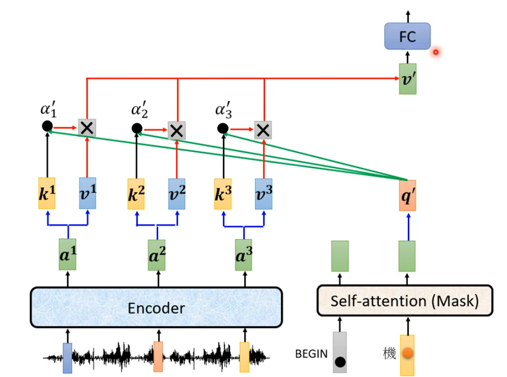

1. 把 Encoder 的输出向量设为 $a^1,a^2,\ldots,a^n$。
2. Decoder 先输入 `<BEGIN>`，经过 Masked Self-Attention 得到表示，再乘参数矩阵得到 $q$。
3. Encoder 的各个输出 $a^i$ 分别乘参数矩阵得到 $k^i$ 和 $v^i$。
4. 接着用 $q$ 和每个 $k^i$ 计算注意力分数，经过 Softmax 得到注意力权重 $\alpha_i$
5. 对所有 $v^i$ 加权求和，得到 Cross-Attention 的输出 $v'$。
6. 经过残差连接、Norm 后作为输入交给 FFN 。


#### 3.5 OUTPUT

Decoder 全部跑完之后，在结尾再添加一个全连接层和softmax层，会得到一个对整个词表的概率分布。

在 **Greedy Decoding** 中，选择概率最高的 token 作为当前输出，并将这个 token 加入 Decoder 的输入中，继续预测下一个 token，如此反复，直到生成 `<EOS>`。

*Greedy Decoding（一般用于推理阶段，训练阶段通常使用Teacher Forcing，即使用真实的前一个 token 作为 Decoder 的输入，后文会详细说明。）*


### 4. 训练

我们希望每个输出的token与预期结果越接近越好，所以目标是minimize cross entropy，跟分类很像。输出的END也要算上。

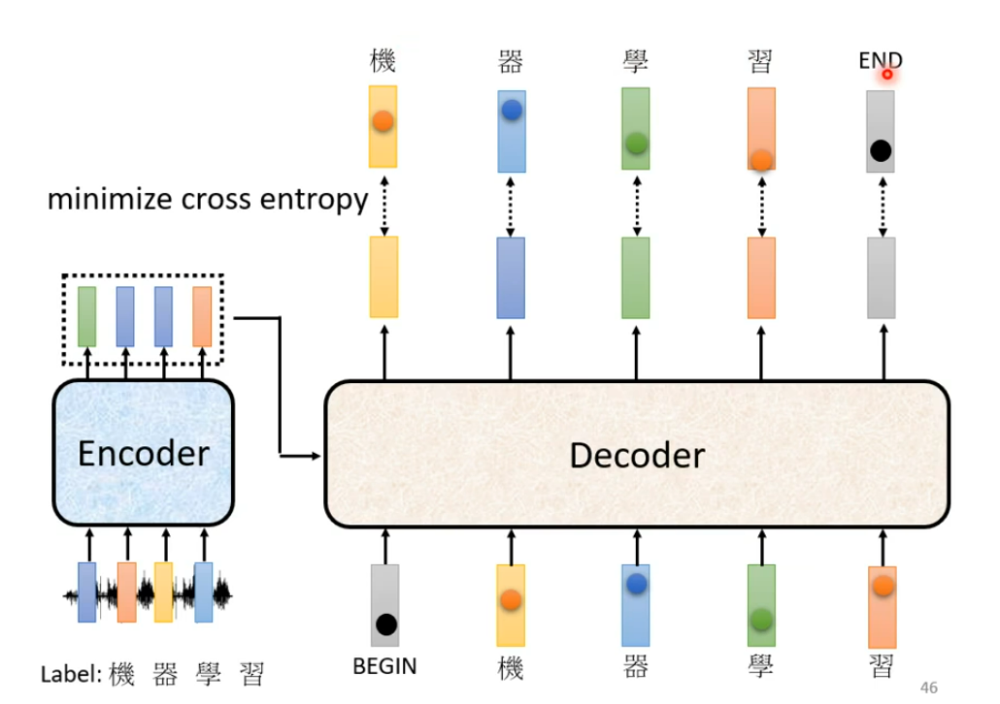

#### Teacher Forcing

训练时，Decoder 在预测当前 token 时，会使用**真实**的前一个 token 作为输入（正确答案），而不是使用**模型自己**上一步预测的 token（自己写的答案）。


#### Tips

##### 1. copy mechanism

允许模型直接从输入中复制 token，尤其适合人名、专有名词、摘要等场景。

**Chat-bot**

比方说，聊天机器人里，用户说：你好，我是库洛洛，但是机器没有必要创造出库洛洛这个词，所以应该直接使用库洛洛这个词。

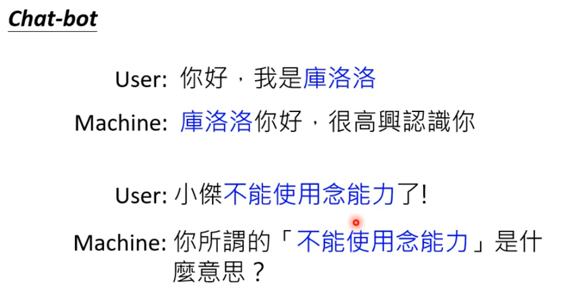

**Summarization**

在做摘要的时候，很多词汇就是直接从文章中复制的。

##### 2. Guided Attention

要求机器在做attention的时候有目的、有方式，引导 Attention 关注符合任务规律的位置。

- Monotonic Attention
- Location-aware attention

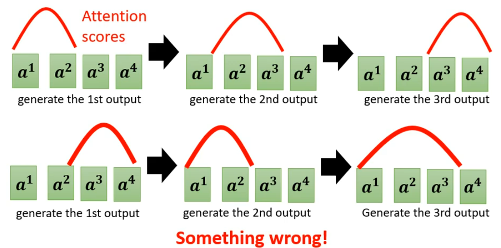


##### 3. Beam Search

假设decoder只能产生2个字，A和B

对decoder而言，在A和B中选择，决定下一个输入是什么，输出是什么，每次找分数最高的作为输出，即贪心策略（Greedy Decoding），但是不一定是最好的。

Beam Search则是：每一步不只保留概率最高的一个结果，而是保留得分最高的前 $k$ 条候选序列，再继续扩展。

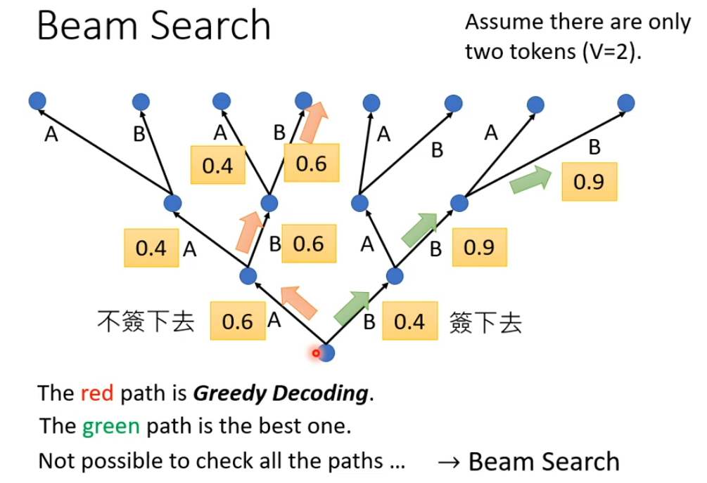

但是Beam Search不一定每次都有用。


##### 4. Scheduled Sampling

训练时偶尔不使用正确答案，而是把 **Decoder 自己上一步预测的token** 作为下一步输入。

目的是减小训练阶段和推理阶段**输入方式不同**带来的 **Exposure Bias**（暴露偏差，即训练时模型看到的上下文，和推理时模型真正面对的上下文不一样）。


## 参考资料

[【機器學習2021】Transformer (上)](https://www.youtube.com/watch?v=n9TlOhRjYoc)

[【機器學習2021】Transformer (下)](https://www.youtube.com/watch?v=N6aRv06iv2g)